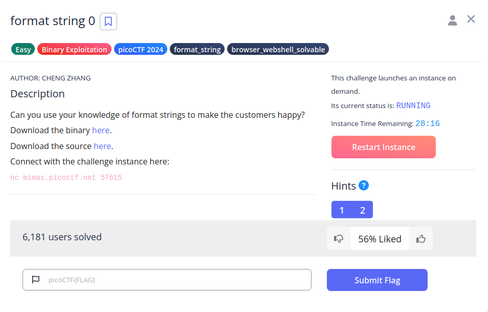
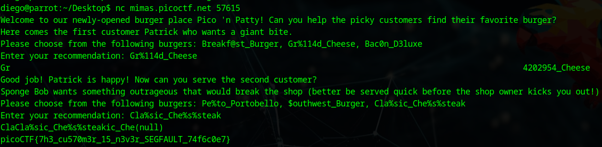

# format string 0


## Descripción
Can you use your knowledge of format strings to make the customers happy?  
Download the binary [here](https://artifacts.picoctf.net/c_mimas/67/format-string-0).  
Download the source [here](https://artifacts.picoctf.net/c_mimas/67/format-string-0.c).  
Connect with the challenge instance here: nc mimas.picoctf.net 57615

## Resolución
Al descargar el archivo en C encontramos las siguientes funciones:

```c
int main(int argc, char **argv){
    FILE *f = fopen("flag.txt", "r");
    if (f == NULL) {
        printf("%s %s", "Please create 'flag.txt' in this directory with your",
                        "own debugging flag.\n");
        exit(0);
    }

    fgets(flag, FLAGSIZE, f);
    signal(SIGSEGV, sigsegv_handler);

    gid_t gid = getegid();
    setresgid(gid, gid, gid);

    serve_patrick();
  
    return 0;
}

void serve_patrick() {
    printf("%s %s\n%s\n%s %s\n%s",
            "Welcome to our newly-opened burger place Pico 'n Patty!",
            "Can you help the picky customers find their favorite burger?",
            "Here comes the first customer Patrick who wants a giant bite.",
            "Please choose from the following burgers:",
            "Breakf@st_Burger, Gr%114d_Cheese, Bac0n_D3luxe",
            "Enter your recommendation: ");
    fflush(stdout);

    char choice1[BUFSIZE];
    scanf("%s", choice1);
    char *menu1[3] = {"Breakf@st_Burger", "Gr%114d_Cheese", "Bac0n_D3luxe"};
    if (!on_menu(choice1, menu1, 3)) {
        printf("%s", "There is no such burger yet!\n");
        fflush(stdout);
    } else {
        int count = printf(choice1);
        if (count > 2 * BUFSIZE) {
            serve_bob();
        } else {
            printf("%s\n%s\n",
                    "Patrick is still hungry!",
                    "Try to serve him something of larger size!");
            fflush(stdout);
        }
    }
}

void serve_bob() {
    printf("\n%s %s\n%s %s\n%s %s\n%s",
            "Good job! Patrick is happy!",
            "Now can you serve the second customer?",
            "Sponge Bob wants something outrageous that would break the shop",
            "(better be served quick before the shop owner kicks you out!)",
            "Please choose from the following burgers:",
            "Pe%to_Portobello, $outhwest_Burger, Cla%sic_Che%s%steak",
            "Enter your recommendation: ");
    fflush(stdout);

    char choice2[BUFSIZE];
    scanf("%s", choice2);
    char *menu2[3] = {"Pe%to_Portobello", "$outhwest_Burger", "Cla%sic_Che%s%steak"};
    if (!on_menu(choice2, menu2, 3)) {
        printf("%s", "There is no such burger yet!\n");
        fflush(stdout);
    } else {
        printf(choice2);
        fflush(stdout);
    }
}
```
Nos está pidiendo que elijamos entre tres opciones dos veces:

"Breakf@st_Burger, Gr%114d_Cheese, Bac0n_D3luxe"
"Pe%to_Portobello, $outhwest_Burger, Cla%sic_Che%s%steak"

En primer lugar, deberemos introducir 'Gr%114d_Cheese'. %1 no es una especificación de formateo válida en C, pero el programa no nos dejará avanzar si elegimos otra opción.

En segundo lugar debemos elegir 'Cla%sic_Che%s%steak', al no estar bien fomateada la opción, el programa lo entiende como %s, que sirve para imprimir un string en C. Con esto evitaremos entrar en la condición del if e introduciremos tres %s en el print siguiente, haciendo posible que el programa nos muestre información almacenada en memoria, como la flag que lee al principio de su ejecución.

El resultado al interactuar con la aplicación es el siguiente:



Obteniendo así la flag: 'picoCTF{7h3_cu570m3r_15_n3v3r_SEGFAULT_74f6c0e7}'.