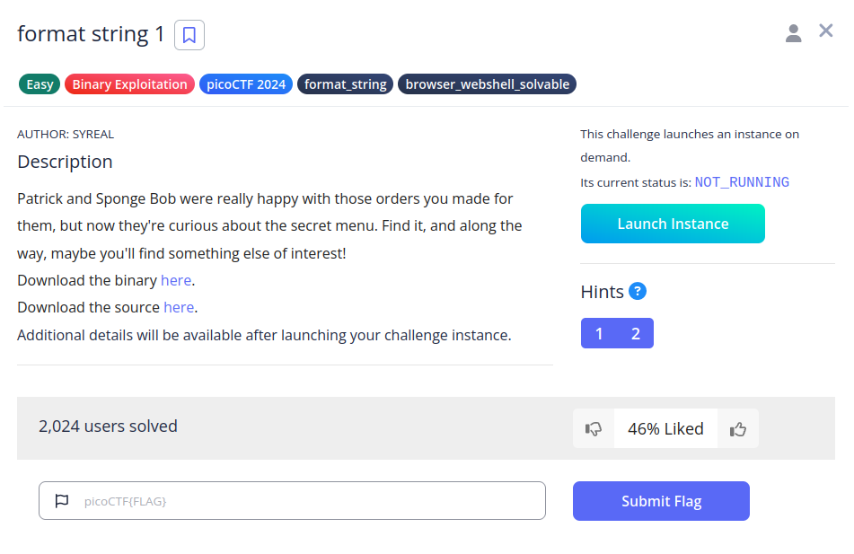
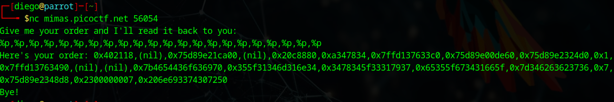
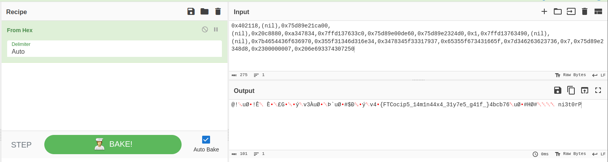
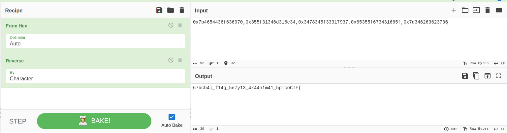

# format string 1


## Descripción
Patrick and Sponge Bob were really happy with those orders you made for them, but now they're curious about the secret menu. Find it, and along the way, maybe you'll find something else of interest!  
Download the binary [here](https://artifacts.picoctf.net/c_mimas/43/format-string-1).  
Download the source [here](https://artifacts.picoctf.net/c_mimas/43/format-string-1.c).

Additional details will be available after launching your challenge instance.

## Resolución
Analizando el código encontramos las siguientes líneas:

```c
scanf("%1024s", buf);
printf("Here's your order: ");
printf(buf);
```

Lo que permite realizar una vulnerabilidad de cadenas de formato, puesto que el 'print(buf)' no comprueba qué está imprimiendo.
Con 'scanf()' guardaremos en 'buf' especificadores de formato. En concreto la siguiente cadena de caracteres:

```
%p,%p,%p,%p,%p,%p,%p,%p,%p,%p,%p,%p,%p,%p,%p,%p,%p,%p,%p,%p,%p,%p
```

Con esto, el programa nos mostrará la información almacenada en sus direcciones de memoria:



Estos valores hexadecimales los debemos llevar a [Cybercheff](https://cyberchef.org/) para poder traducirlos cómodamente:



Se puede apreciar el formato de una flag, pero para verla mejor limpiaremos el ruido y revertiremos la flag:



Ahora hay que reordenar los fragmentos, creando así la flag: 'picoCTF{7y13_4x4_f14g_5e67bcb4}'.