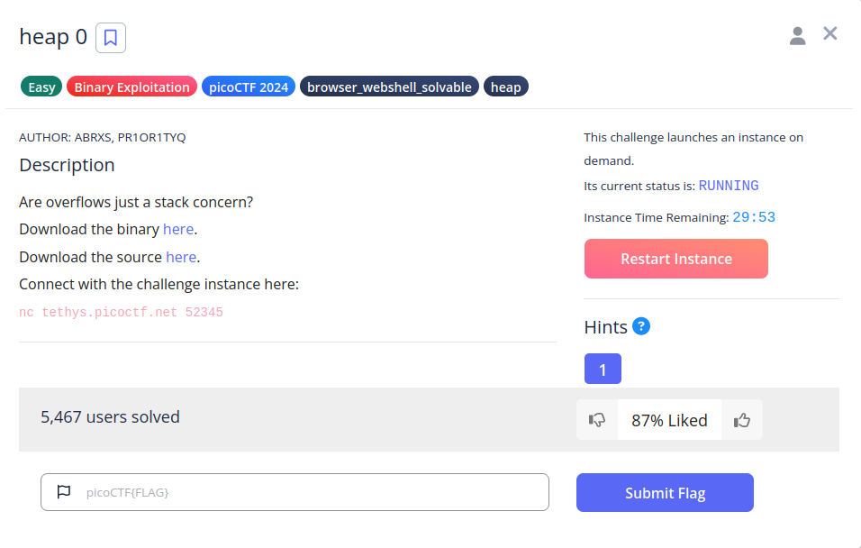
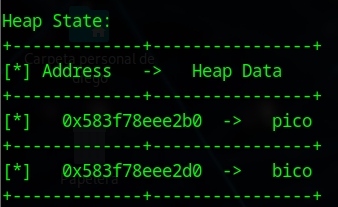
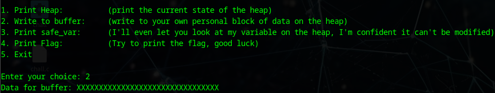
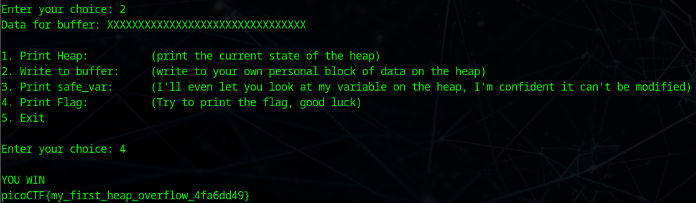

# heap 0


## Descripción
Are overflows just a stack concern?  
Download the binary [here](https://artifacts.picoctf.net/c_tethys/13/chall).  
Download the source [here](https://artifacts.picoctf.net/c_tethys/13/chall.c).  
Connect with the challenge instance here: nc tethys.picoctf.net 52345

## Resolución
Al descargar el archivo en C encontramos las siguientes funciones importantes:

```c
void check_win() {
    if (strcmp(safe_var, "bico") != 0) {
        printf("\nYOU WIN\n");

        // Print flag
        char buf[FLAGSIZE_MAX];
        FILE *fd = fopen("flag.txt", "r");
        fgets(buf, FLAGSIZE_MAX, fd);
        printf("%s\n", buf);
        fflush(stdout);

        exit(0);
    } else {
        printf("Looks like everything is still secure!\n");
        printf("\nNo flage for you :(\n");
        fflush(stdout);
    }
}
```
'check_win()' imprime la flag en el caso de que se modifique la variable 'safe_var'.
Esta variable está declarada en el heap:

```c
int num_allocs;
char *safe_var;
char *input_data;
```

Con lo cual puede ser modificada si introducimos en 'input_data' la suficiente información podremos sobreescribir la siguiente variable del programa, 'safe_var'.
'input_data' es modificada a través de 'write_buffer()', la cual es vulnerable a un heap overflow, puesto que no valida la entrada de información:

```c
void write_buffer() {
    printf("Data for buffer: ");
    fflush(stdout);
    scanf("%s", input_data);
}
```

Para ello, necesitamos ver las direcciones de memoria, que el propio programa nos las da al ser iniciado.



Procedemos a hacer la resta de direcciones de memoria:

0x615813aaa2d0 - 0x615813aaa2b0 = 0x20

0x20 en decimal es 32, por lo que hay 32 bnytes de espacio entre las variables 'input_data' y 'safe_var'.
Tendremos que escribir entonces 32 caracteres en 'input_data' para llegar a modificar la información de 'safe_var'.



Con lo que ahora, si le pedimos la flag, nos la imprimirá al haber modificado la variable:



Obteniendo así la flag: 'picoCTF{my_first_heap_overflow_4fa6dd49}'.