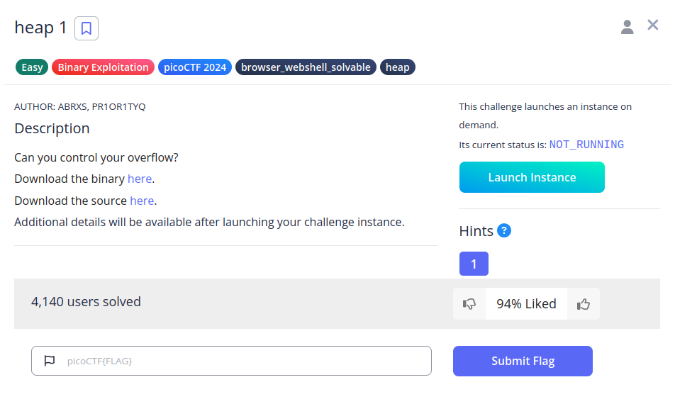
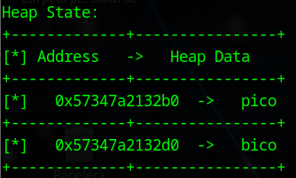
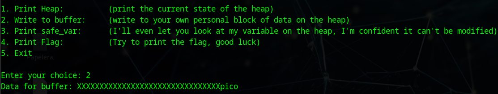
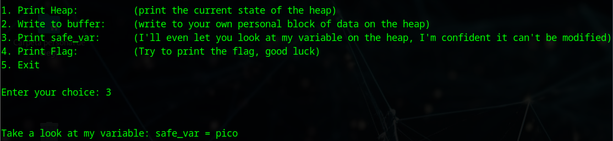
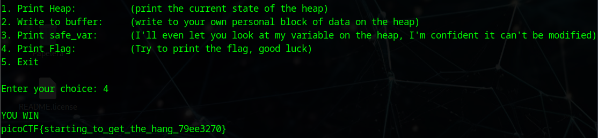

# Binary Searh


## Descripción
Can you control your overflow?  
Download the binary [here](https://artifacts.picoctf.net/c_tethys/1/chall).  
Download the source [here](https://artifacts.picoctf.net/c_tethys/1/chall.c).

Additional details will be available after launching your challenge instance.

## Resolución
Descargamos el archivo fuente y lo examinamos. Es exactamente igual que [heap 0](https://github.com/Diego-san-2000/PicoCTF_2024/tree/master/Binary%20Exploitation/heap%200), pero cambiando la condición para mostrar la flag:

```c
if (!strcmp(safe_var, "pico"))
```

'strcmp' compara la variable de 'safe_var' con "pico", si son idénticas devuelve 0, como está negado al inicio de la condición gracias al '!', se cambiará a 1, es decir, true (dado que en C no existen booleanos, 1 se corresponde con true y 0 con falso).

Lanzamos la aplicación y volvemos a calcular el espacio entre variables del heap:



0x57347a2132d0 - 0x57347a2132b0 = 0x32

Por lo que deberemos escribir 32 letras en 'pico' para llegar de la variable 'pico' a 'bico'.



Al final, estaremos escribiendo en la dirección de memoria que corresponde a 'bico', por lo que introducimos 'pico' para que el if mencionado de 1 (true).



Ahora cuando pidamos la flag, la condición se cumplirá y nos será mostrada:



Obteniendo así la flag: 'picoCTF{starting_to_get_the_hang_79ee3270}'.