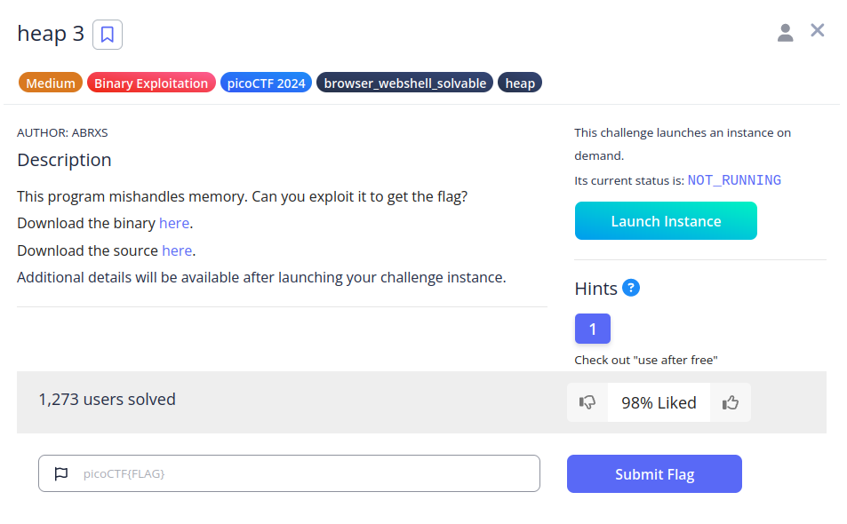
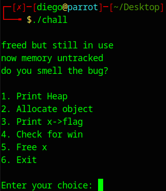
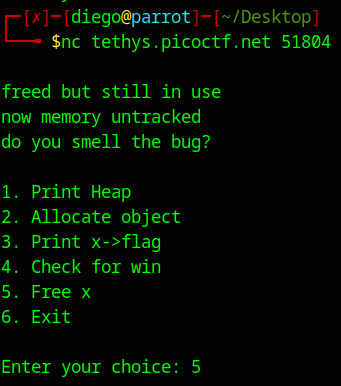
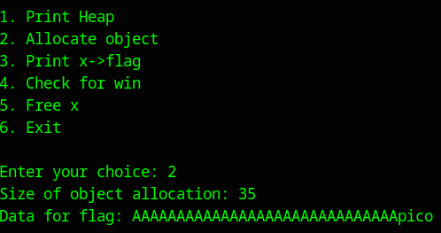
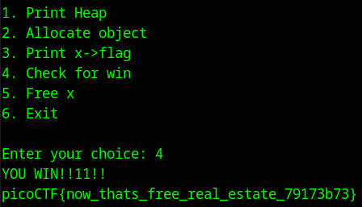

# heap 3


## Descripción
This program mishandles memory. Can you exploit it to get the flag?  
Download the binary [here](https://artifacts.picoctf.net/c_tethys/4/chall).  
Download the source [here](https://artifacts.picoctf.net/c_tethys/4/chall.c).

Additional details will be available after launching your challenge instance.

## Resolución
Al dar al programa permisos de ejecución y ejecutarlo obtendremos el siguiente menú:

```bash
chmod +x chall
```

```bash
./chall
```



Con estas opciones, tenemos que hacer cumplir la condición:

```c
if(!strcmp(x->flag, "pico"))
```

Además, nos da la pista:
"freed but still in use  
now memory untracked  
do you smell the bug?"

Esto se debe a la función 'free_memory()', accesible con la opción 5:

```c
void free_memory() {
    free(x);
}
```

Debido a que x no se actualiza a null, el puntero de x sigue apuntanto a la dirección de memoria de x, por lo que al crear un nuevo objeto, podemos cambiar el valor de x->flag. Esta vulnerabilidad se conoce como 'use-after-free', puesto que se sigue usando el puntero después de haber sido liberado.

También tenemos que tener en cuenta la estructura de x:

```c
typedef struct {
  char a[10];
  char b[10];
  char c[10];
  char flag[5];
} object;

int num_allocs;
object *x;
```

Con lo cual, la forma de proceder es la siguiente:
1. Liberamos la memoria (opción 5)
2. Creamos un nuevo objeto (opción 2)
3. Seleccionamos que el nuevo objeto tenga el tamaño de 35 (para poder llegar a x->flag)
4. El contenido del objeto será 'AAAAAAAAAAAAAAAAAAAAAAAAAAAAAApico'.
5. Comprobamos la condición de victoria (opción 4)







Obteniendo así la flag: 'picoCTF{now_thats_free_real_estate_79173b73}'.