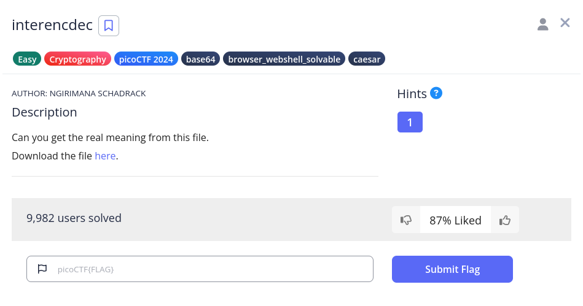
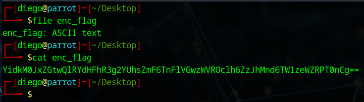
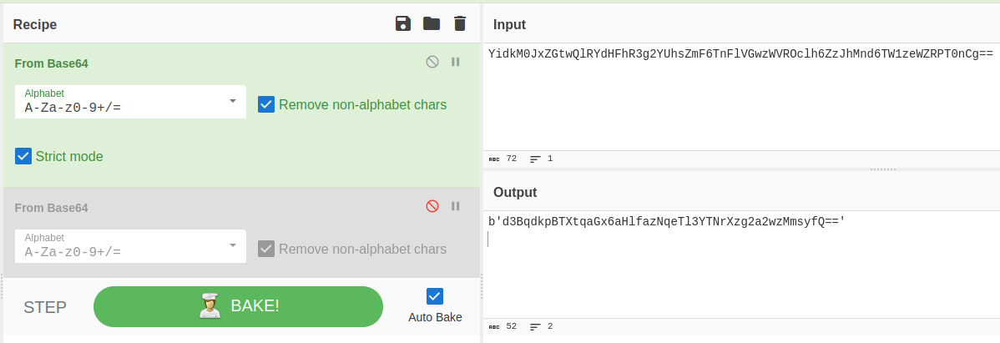
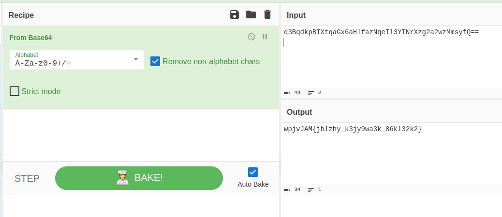
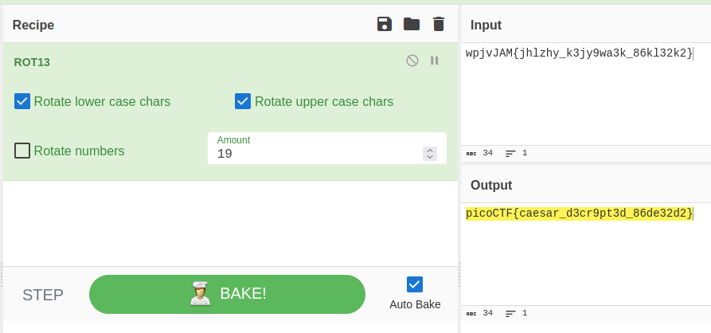

# interencdec


## Descripción
Can you get the real meaning from this file.  
Download the file [here](https://artifacts.picoctf.net/c_titan/110/enc_flag). 

## Resolución
Descargamos el archivo y vemos qué es con el comando file:

```bash
file enc_flag
```

Tras esto, al ser un archivo de texto ASCII vemos su contenido:

```bash
cat enc_flag
```



Parece que está codificado en base64 (acaba con '=='), por lo que acudimos a [Cybercheff](https://cyberchef.org/):



El resultado parece que vuelve a estar codificado en base64, limpiamos el ruido y volvemos a realizar el proceso:




Ahora tiene el formato de una flag, probamos con el cifrado césar, (en Cybercheff es con ROT13) e indicamos el desplazamiento suficienta para que la w pase a ser p. En este caso es 19:



Obteniendo así la flag: 'picoCTF{caesar_d3cr9pt3d_86de32d2}'.