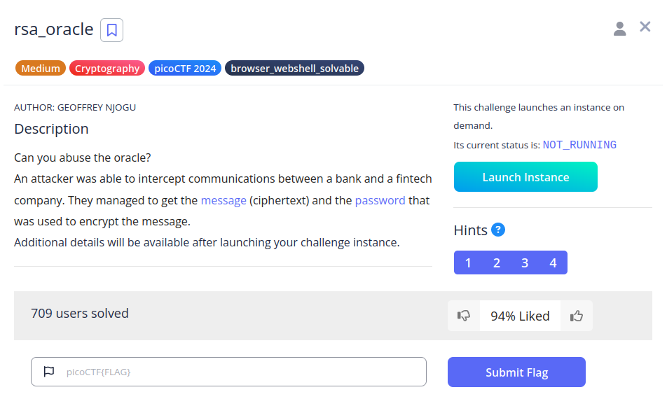
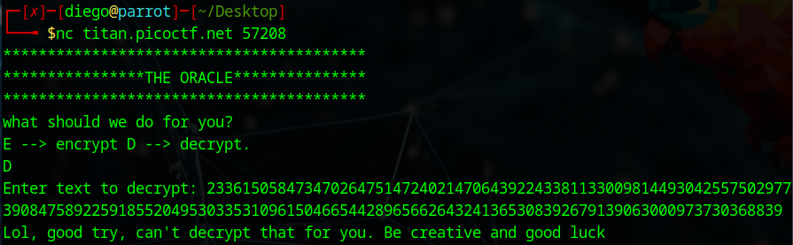
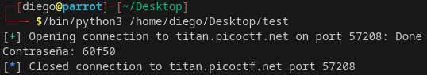
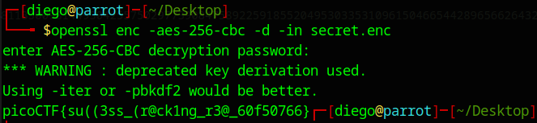

# rsa_oracle


## Descripción
Can you abuse the oracle? An attacker was able to intercept communications between a bank and a fintech company. They managed to get the [message](https://artifacts.picoctf.net/c_titan/150/secret.enc) (ciphertext) and the [password](https://artifacts.picoctf.net/c_titan/150/password.enc) that was used to encrypt the message.

Additional details will be available after launching your challenge instance.

## Resolución
Para poder resolver el CTF, primero tenemos que entender cómo funciona el algoritmo RSA:

- C = M^e mod n
- - C es el texto cifrado
- - M es el Mensaje a cifrar
- - e es el exponente, normalmente 65537
- - n es p * q, la multiplicación de las claves pública y privada.

Al lanzar la instancia, podremos conectarnos a un servidor que sirve para cifrar y descifrar con este algoritmo, pero no podremos introducir directamente la contraseña:



Podemos, sin embargo, usar una propiedad de este cifrado para realizar un "ataque de texto cifrado multiplicativo":

- C1 × C2 mod n = (M1 × M2)^e
- - C1 es el texto cifrado que recibimos
- - C2 es la contraseña cifrada
- - M1 es el texto plano que enviamos
- - M2 es la contraseña que queremos obtener

Al descifrar el producto (M1 × M2)^e, se obtiene (M1 × M2), por lo que es cuestión de deshacer la multiplicación y formatear la salida:

```python
from pwn import *

C2 = 2336150584734702647514724021470643922433811330098144930425575029773908475892259185520495303353109615046654428965662643241365308392679139063000973730368839
M1 = 25

p = remote("titan.picoctf.net", 57208)

p.recvuntil(b"decrypt.")
p.sendline(b"E")
p.recvuntil(b"keysize): ")
p.sendline(M1.to_bytes(1, "big")) # M1 codificado
p.recvuntil(b"mod n) ")

C1 = int(p.recvline())

p.sendline(b"D")
p.recvuntil(b"decrypt: ")
p.sendline(str(C1*C2).encode())
p.recvuntil(b"mod n): ")

password = int(p.recvline(), 16) // M1 #Indicamos que se recibe en formato hexadecimal (16) y quitamos el M1 que hemos añadido
M2 = password.to_bytes(len(str(password))-7, "big").decode("utf-8") #Convertimos el valor numérico a texto

print("Contraseña:", M2)
```



Obtenemos así la contraseña '60f50', por lo que procedemos a descifrar el archivo 'secret.enc':

```bash
openssl enc -aes-256-cbc -d -in secret.enc
```

Introducimos la contraseña:



Y obtenemos así la flag: 'picoCTF{su((3ss_(r@ck1ng_r3@_60f50766}'.