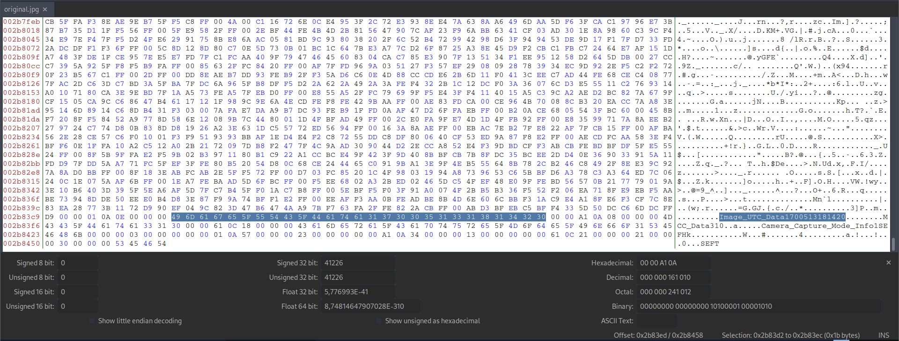

# Blast from the past


## Descripción
The judge for these pictures is a real fan of antiques. Can you age this photo to the specifications?  
Set the timestamps on this picture to 1970:01:01 00:00:00.001+00:00 with as much precision as possible for each timestamp. In this example, +00:00 is a timezone adjustment. Any timezone is acceptable as long as the time is equivalent. As an example, this timestamp is acceptable as well: 1969:12:31 19:00:00.001-05:00. For timestamps without a timezone adjustment, put them in GMT time (+00:00). The checker program provides the timestamp needed for each.  
Use this [picture](https://artifacts.picoctf.net/c_mimas/73/original.jpg).  
Additional details will be available after launching your challenge instance.

## Resolución
Nos descargamos la foto que nos proporcionan:


Buscamos con exiftool los valores que tenemos que modificar:

```bash
exiftool original.jpg | grep "Date"
```


La copiamos para no alterar la original:

```bash
cp original.jpg original_modified.jpg
```

Y cambiamos sus metadatos con exiftool:

```bash
exiftool -AllDates='1970:01:01 00:00:00.001' -CreateDate='1970:01:01 00:00:00.001' -DateTimeOriginal='1970:01:01 00:00:00.001' -ModifyDate='1970:01:01 00:00:00.001' -SubSecCreateDate='1970:01:01 00:00:00.001' -SubSecDateTimeOriginal='1970:01:01 00:00:00.001' -SubSecModifyDate='1970:01:01 00:00:00.001' original_modified.jpg
```

Sin ebmargo, todavía queda un metadato que modificar, para el que tendremos que usar un editor hexadecimal:

```bash
bless original_modified.jpg
```



Cambiamos el valor señalado por 'Image_UTC_Data0000000000001':


Y volvemos a comprobar que los valore se han cambiado correctamente:


Entonces, lanzamos la instancia y ejecutamos los comandos:

```bash
nc -w 2 mimas.picoctf.net 64414 < original_modified.jpg
```

```bash
nc mimas.picoctf.net 49367
```


Obteniendo así la flag: 'picoCTF{71m3_7r4v311ng_p1c7ur3_3e336564}'.