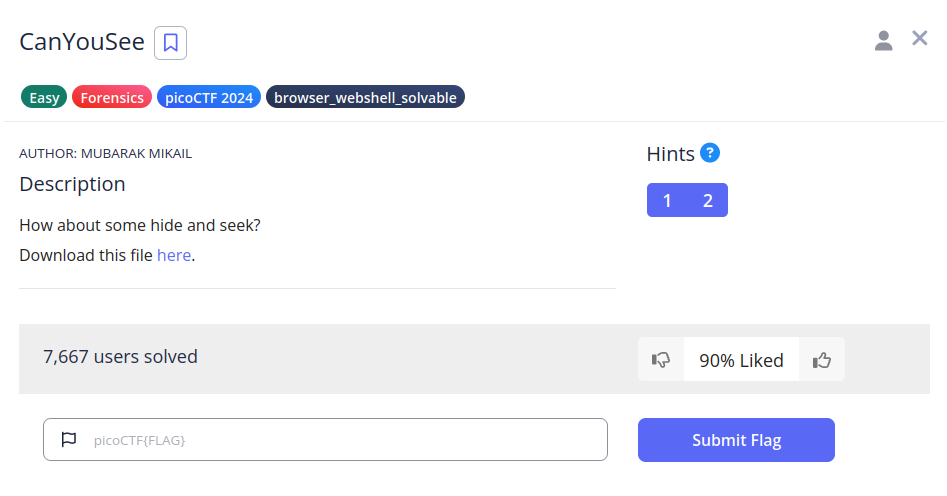
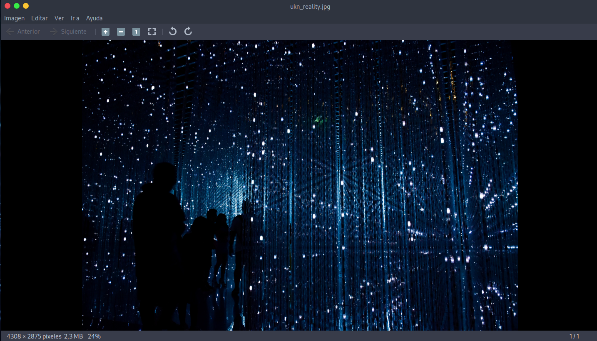
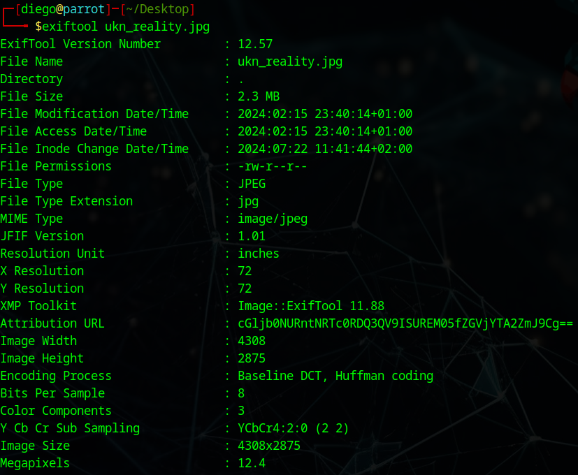
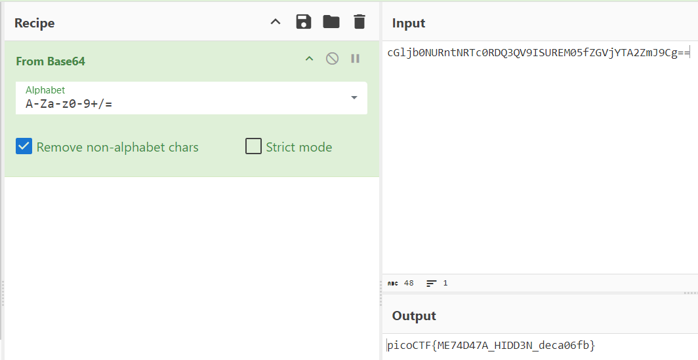

# CanYouSee


## Descripción
How about some hide and seek? Download this file [here](https://artifacts.picoctf.net/c_titan/4/unknown.zip).

## Resolución
Descargamos el archivo.zip y lo descomprimimos:

```bash
unzip unknown.zip
```



Parece ser una imagen, analizaremos sus metadatos:

```bash
exiftool ukn_reality.jpg
```



El campo 'Attribution URL' parece estar codificado en Base64 (debido a que termina con '=='), por lo que lo introducimos en [Cybercheff](https://gchq.github.io/CyberChef/)



Obteniendo así la flag: 'picoCTF{ME74D47A_HIDD3N_deca06fb}'.