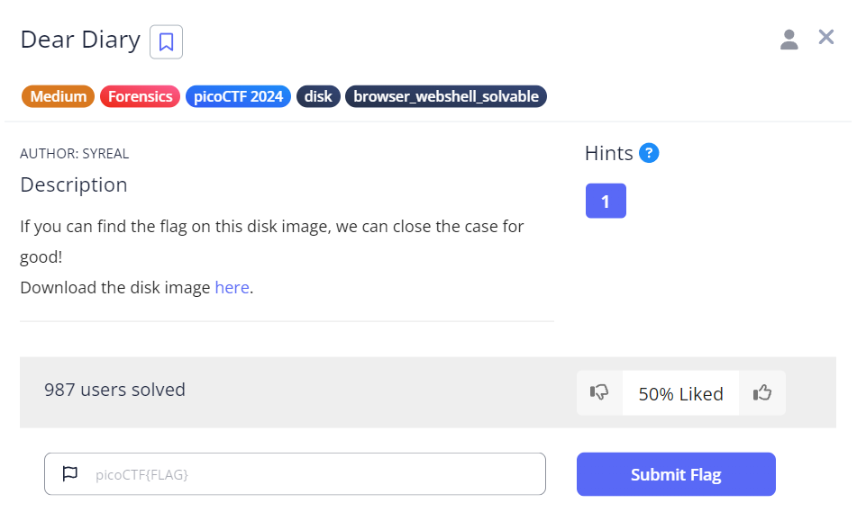
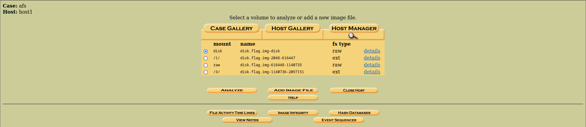
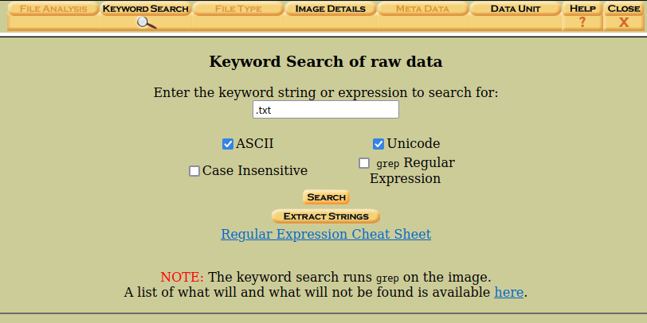
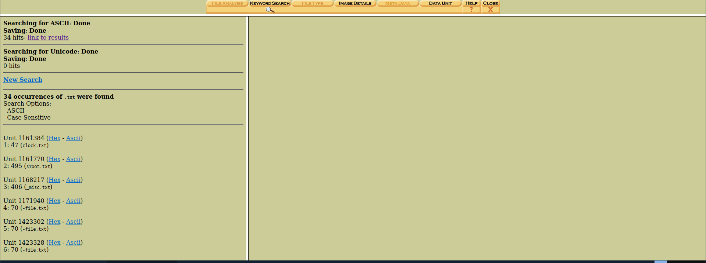
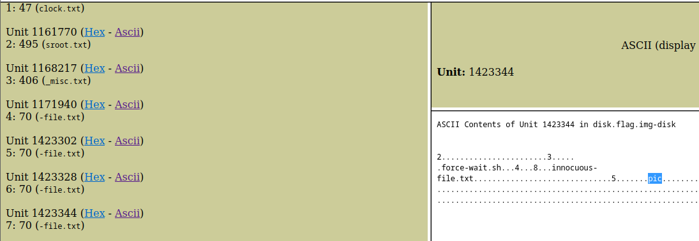
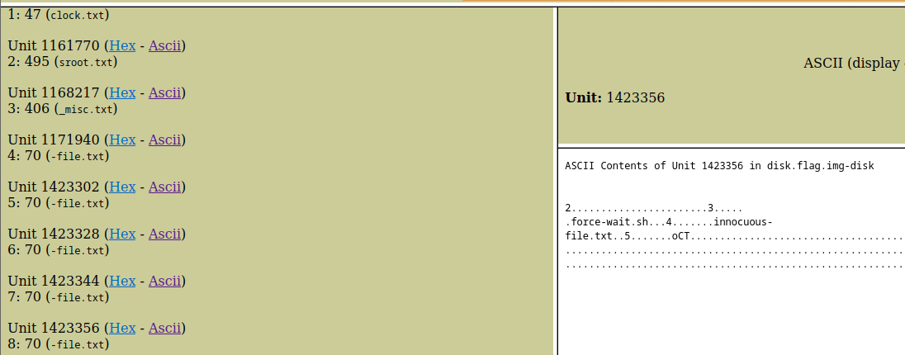

# Dear Diary


## Descripción
If you can find the flag on this disk image, we can close the case for good!  
Download the disk image [here](https://artifacts.picoctf.net/c_titan/63/disk.flag.img.gz).

## Resolución
Nos descargamos el archivo, es un comprimido .gz, por lo que procedemos a descomprimirlo:

```bash
gunzip disk.flag.img.gz
```

Como es una imagen de disco, la abrimos con autopsy:

```bash
sudo autopsy
```

Vamos a la url 'http://localhost:9999/autopsy' y creamos un caso con la imagen del disco descomprimida.



Una vez creada, analizamos el disco. Seleccionamos 'Keyword search' y buscamos '.txt'



Una vez que la búsqueda finalice, encontrará 34 resultados:



A partir del resultado 7 podremos ver el inicio de la flag, que tendremos que construir de 3 letras en 3 letras.





Dando como resultado la flag: 'picoCTf{1_533_n4m35_80d24b30}'.