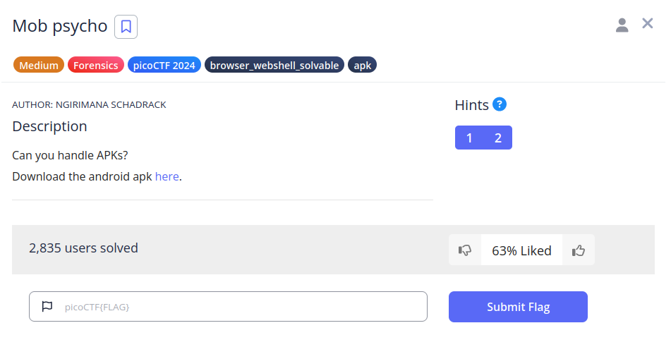
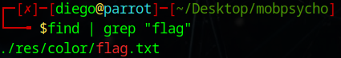
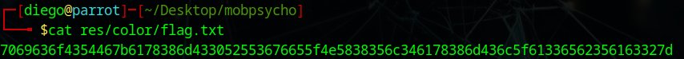
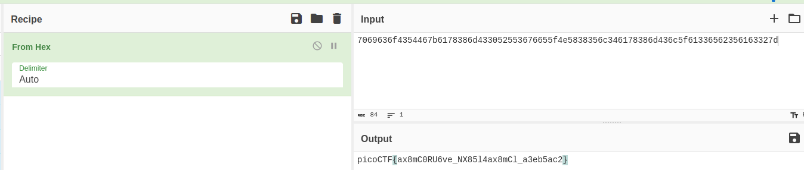

# Mob psycho


## Descripción
Can you handle APKs?  
Download the android apk [here](https://artifacts.picoctf.net/c_titan/53/mobpsycho.apk).

## Resolución
Nos descargamos el archivo, creamos una carpeta nueva, lo movemos a ella y extraemos (los archivos .apk se pueden descomprimir como si fueran un .zip):

```bash
mkdir mobpsycho
mv mobpsycho.apk mobpsycho
cd mobpsycho
unzip mobpsycho.apk
```

Ahora, buscaremos dentro la flag:

```bash
find | grep "flag"
```



```bash
cat res/color/flag.txt
```



Parece una cadena de caracteres en hexadecimal (porque los valores van de 0 a f), acudiremos a [Cybercheff](https://cyberchef.org/) para descifrarla:



Obteniendo así la flag: 'picoCTF{ax8mC0RU6ve_NX85l4ax8mCl_a3eb5ac2}'.