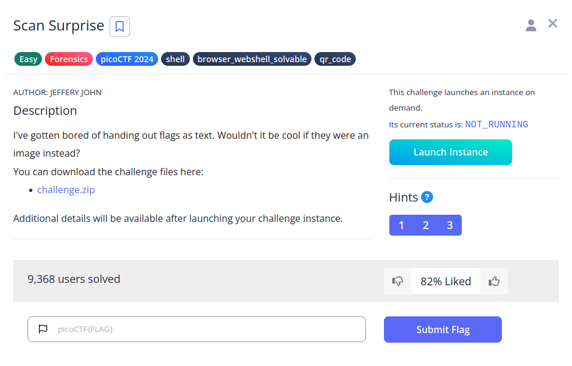
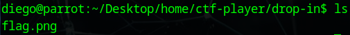
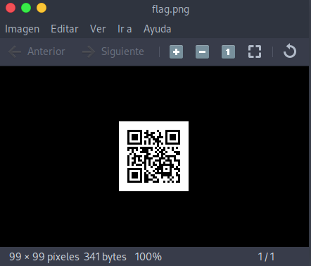
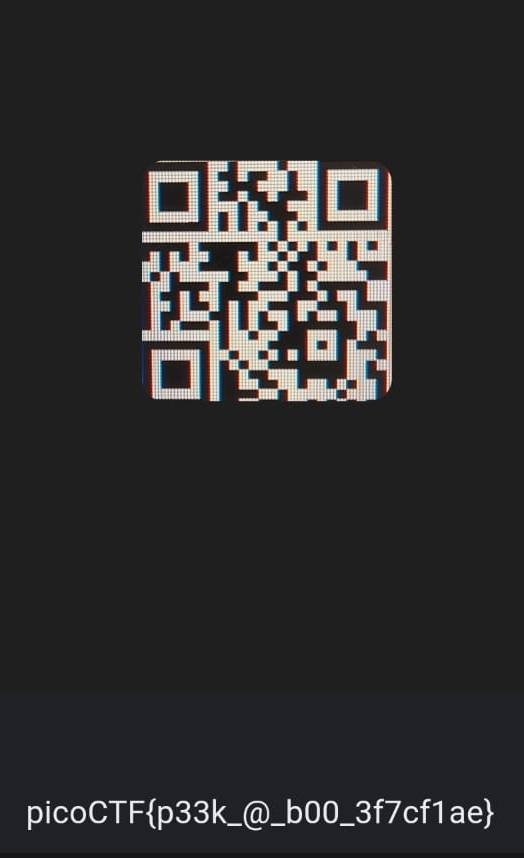

# Scan Surprise

## Descripción
I've gotten bored of handing out flags as text. Wouldn't it be cool if they were an image instead?
You can download the challenge files here:

- [challenge.zip](https://artifacts.picoctf.net/c_atlas/1/challenge.zip)

Additional details will be available after launching your challenge instance.

## Resolución
Extraemos el contenido del archivo comprimido:

´´´bash
unzip challenge.zip
´´´

Se nos creará la estructura de carpetas 'home/ctf-player/drop-in' con el siguiente contenido:

Si escaneamos el código nos dará el siguiente resultado:

A mi no me ha funcionado ningún servicio de escaneo de qr online, así que he tenido que usar Google Lens.

La flag obtenida es 'picoCTF{p33k_@_b00_3f7cf1ae}'.