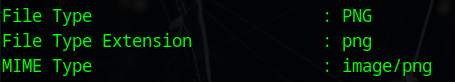
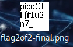

# Secret of the Polyglot


## Descripción
The Network Operations Center (NOC) of your local institution picked up a suspicious file, they're getting conflicting information on what type of file it is. They've brought you in as an external expert to examine the file. Can you extract all the information from this strange file? Download the suspicious file [here](https://artifacts.picoctf.net/c_titan/97/flag2of2-final.pdf).

## Resolución
El archivo proporcionado es un pdf:


Analizaremos el archivo con exiftool primero:

```bash
exiftool flag2of2-final.pdf 
```



Y nos daremos cuenta de que, en realidad, es un archivo .png, por lo que le cambiamos la extensión:

```bash
cp flag2of2-final.pdf flag2of2-final.png
```

Al crearse el archivo, veremos en la miniatura el inicio de la flag:



Juntando las dos partes, conseguiremos la flag: 'picoCTF{f1u3n7_1n_pn9_&_pdf_724b1287}'.