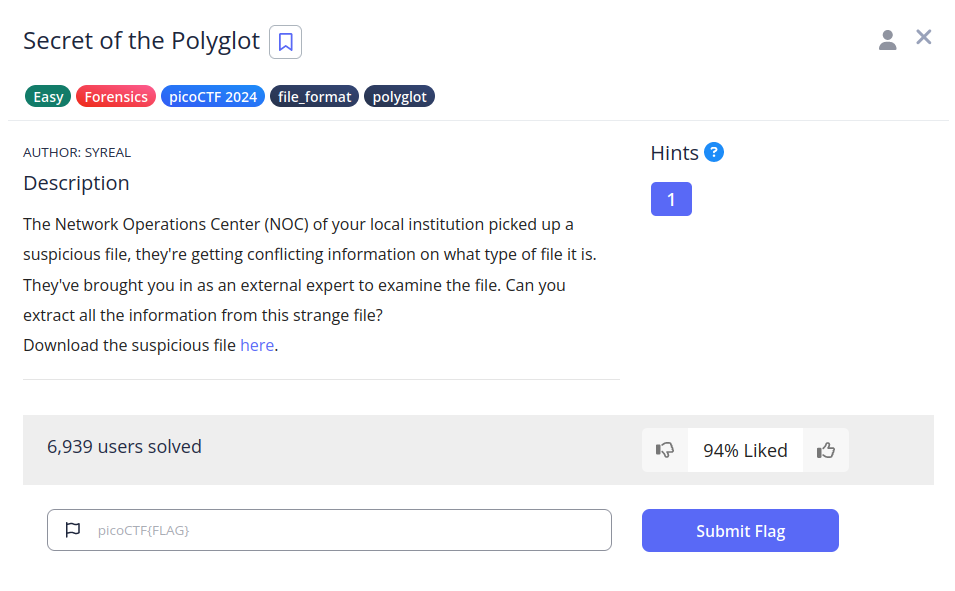

# Secret of the Polyglot

## Descripción
The Network Operations Center (NOC) of your local institution picked up a suspicious file, they're getting conflicting information on what type of file it is. They've brought you in as an external expert to examine the file. Can you extract all the information from this strange file? Download the suspicious file [here](https://artifacts.picoctf.net/c_titan/97/flag2of2-final.pdf).

## Resolución
El archivo proporcionado es un pdf:

