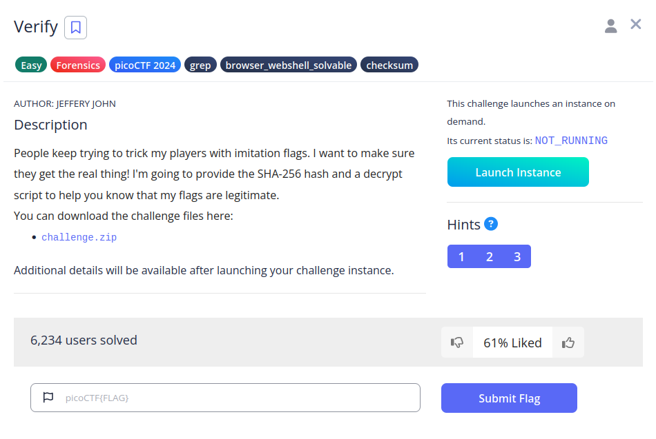
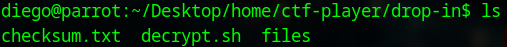
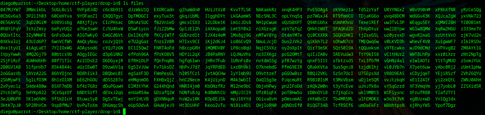
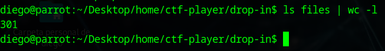
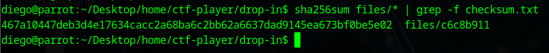
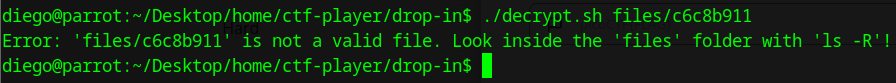
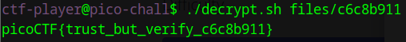

# Verify


## Descripción
People keep trying to trick my players with imitation flags. I want to make sure they get the real thing! I'm going to provide the SHA-256 hash and a decrypt script to help you know that my flags are legitimate. You can download the challenge files here:

- [challenge.zip](https://artifacts.picoctf.net/c_rhea/10/challenge.zip)

Additional details will be available after launching your challenge instance.

## Resolucion
Extraemos el contenido del archivo comprimido:

´´´bash
unzip challenge.zip
´´´

Se nos creará la estructura de carpetas 'home/ctf-player/drop-in' con el siguiente contenido:



Dentro de files, existen 301 archivos distintos:





El contenido de checksum.txt es el siguiente:

467a10447deb3d4e17634cacc2a68ba6c2bb62a6637dad9145ea673bf0be5e02

Y el de de 'decrypt.sh':

```bash
#!/bin/bash

# Check if the user provided a file name as an argument
if [ $# -eq 0 ]; then
    echo "Expected usage: decrypt.sh <filename>"
    exit 1
fi

# Store the provided filename in a variable
file_name="$1"

# Check if the provided argument is a file and not a folder
if [ ! -f "/home/ctf-player/drop-in/$file_name" ]; then
    echo "Error: '$file_name' is not a valid file. Look inside the 'files' folder with 'ls -R'!"
    exit 1
fi

# If there's an error reading the file, print an error message
if ! openssl enc -d -aes-256-cbc -pbkdf2 -iter 100000 -salt -in "/home/ctf-player/drop-in/$file_name" -k picoCTF; then
    echo "Error: Failed to decrypt '$file_name'. This flag is fake! Keep looking!"
fi
```

La última condición descifra con AES-256-CBC y la contraseña 'picoCTF', mostrando un mensaje de error si la flag es incorrecta.

Con lo cual, hay que encontrar el archivo que pasar por parámetro a 'decrypt.sh'. Para ello calcularemos los checksums de todos archivos de 'files' y buscaremos el correcto:

```bash
sha256sum files/* | grep -f checksum.txt 
```



Encontramos así el archivo 'c6c8b911'. El problema es que al usarlo con decrypt.sh no funciona:

```bash
./decrypt.sh files/c6c8b911
```



Por lo que lanzamos la instancia y ejecutamos el mismo comando:



Obteniendo así la flag 'picoCTF{trust_but_verify_c6c8b911}'.