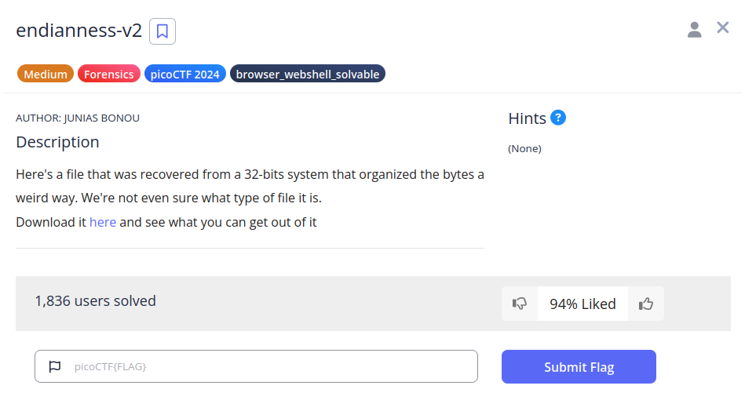
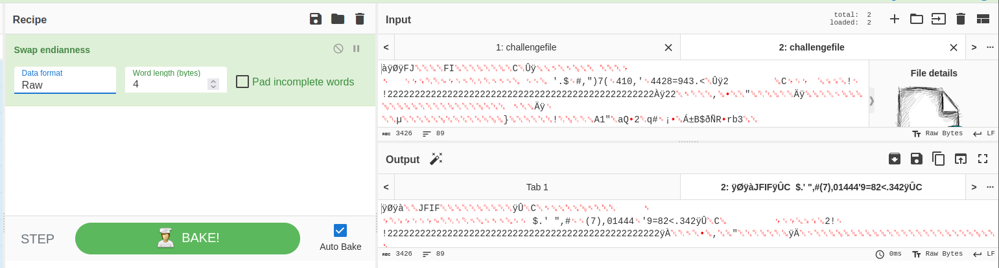
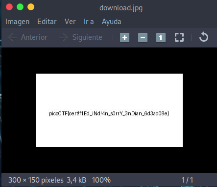

# endianness-v2

## Descripción
Here's a file that was recovered from a 32-bits system that organized the bytes a weird way. We're not even sure what type of file it is.  
Download it [here](https://artifacts.picoctf.net/c_titan/113/challengefile) and see what you can get out of it 

## Resolución
Descargamos el archivo y lo llevamos a [Cyberchef](https://cyberchef.org/) para cambiar el endian:

En el formato de dato tenemos que seleccionar "Raw", y en el resultado, veremos que tiene 'JFIF', por lo que lo guardamos como un archivo .jpg. Al abrirlo veremos lo siguiente:

Obteniendo así la flag: 'picoCTF{cert!f1Ed_iNd!4n_s0rrY_3nDian_6d3ad08e}'.