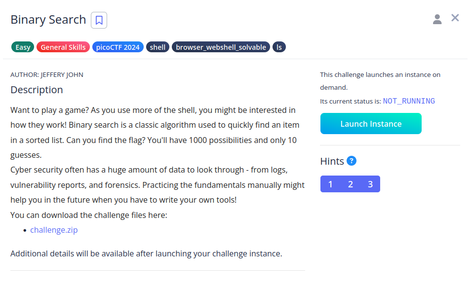
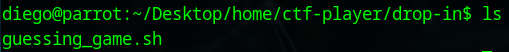
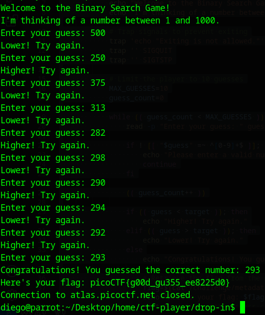

# Binary Searh


## Descripción
Want to play a game? As you use more of the shell, you might be interested in how they work! Binary search is a classic algorithm used to quickly find an item in a sorted list. Can you find the flag? You'll have 1000 possibilities and only 10 guesses. Cyber security often has a huge amount of data to look through - from logs, vulnerability reports, and forensics. Practicing the fundamentals manually might help you in the future when you have to write your own tools! You can download the challenge files here:

- [challenge.zip](https://artifacts.picoctf.net/c_atlas/4/challenge.zip)

Additional details will be available after launching your challenge instance.

## Resolución
Extraemos el contenido del archivo comprimido:

´´´bash
unzip challenge.zip
´´´

Se nos creará la estructura de carpetas 'home/ctf-player/drop-in' con el siguiente contenido:



```bash
#!/bin/bash

# Generate a random number between 1 and 1000
target=$(( (RANDOM % 1000) + 1 ))

echo "Welcome to the Binary Search Game!"
echo "I'm thinking of a number between 1 and 1000."

# Trap signals to prevent exiting
trap 'echo "Exiting is not allowed."' INT
trap '' SIGQUIT
trap '' SIGTSTP

# Limit the player to 10 guesses
MAX_GUESSES=10
guess_count=0

while (( guess_count < MAX_GUESSES )); do
    read -p "Enter your guess: " guess

    if ! [[ "$guess" =~ ^[0-9]+$ ]]; then
        echo "Please enter a valid number."
        continue
    fi

    (( guess_count++ ))

    if (( guess < target )); then
        echo "Higher! Try again."
    elif (( guess > target )); then
        echo "Lower! Try again."
    else
        echo "Congratulations! You guessed the correct number: $target"

        # Retrieve the flag from the metadata file
        flag=$(cat /challenge/metadata.json | jq -r '.flag')
        echo "Here's your flag: $flag"
        exit 0  # Exit with success code
    fi
done

# Player has exceeded maximum guesses
echo "Sorry, you've exceeded the maximum number of guesses."
exit 1  # Exit with error code to close the connection
```

El programa nos obliga a adivinar un número, pera ello nos proporciona 10 intentos y nos dirá si el número introducido es mayor o menor. El nombre del CTF 'Binary Search' nos da una pista de como hacerlo.

La búsqueda binaria consiste en:
1. Se ordenan los elementos a buscar
2. Se divide el conjunto en dos elementos de igual tamaño.
2. Se escoge el elemento de en medio
3. Obtenemos si el número a buscar es mayor o menor, segun esto, nos dirigimos a esa mitad, la volvemos a dividir en otros dos conjuntos y repetimos el paso 2.

Lanzamos la instancia y nos conectamos con:

```bash
ssh -p 54090 ctf-player@atlas.picoctf.net
```

Como es entre 1 y 1000, empezaremos por el 500 e iremos decidiendo sobre la marcha:



Para calcular el número a introducir, deberemos sumar los dos números más cercanos al desconocido y dividirlos entre 2.
Por ejemplo, si 250 es menor que el número y 375 está por encima, el número a introducir es 313.
313 Sustituirá a 250 o a 375, dependiendo si es mayor que el número a adivinar o menor.

Así se obtiene la flag: 'picoCTF{g00d_gu355_ee8225d0}'.