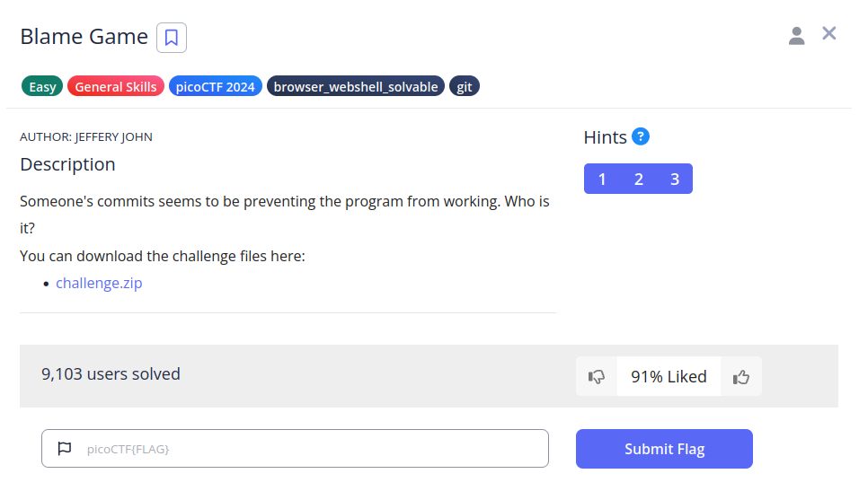
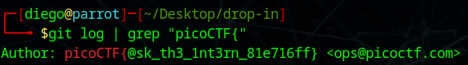

# Blame Game


## Descripción
Someone's commits seems to be preventing the program from working. Who is it?  
You can download the challenge files here:
- [challenge.zip](https://artifacts.picoctf.net/c_titan/159/challenge.zip)

## Resolución
Descargamos y extraemos el archivo:

```bash
unzip challenge.zip
```

Tenemos que buscar a un autor del commit que no funciona. Para hacer esto podemos usar:

```bash
git log
```

Y veremos una lista de todos los commits. Como hay demasiados, añadiremos el comando 'grep' para buscar:

```bash
git log | grep "picoCTF{"
```

Obteniendo el siguiente resultado:



Y, por tanto, la flag: 'picoCTF{@sk_th3_1nt3rn_81e716ff}'.