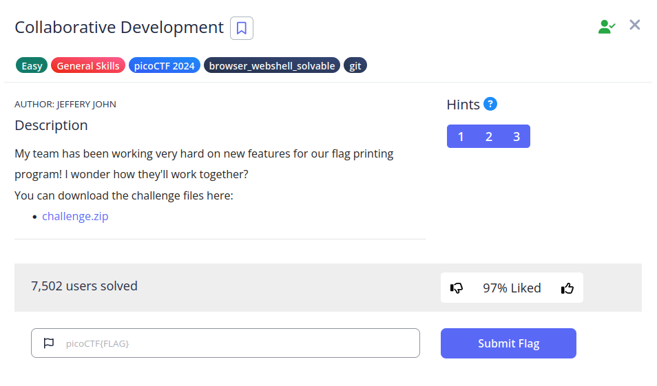
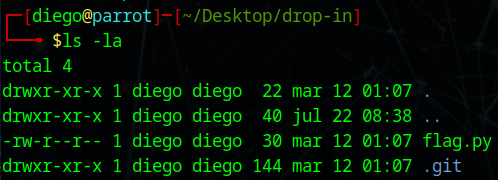
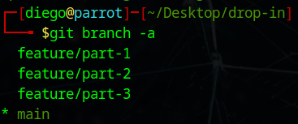
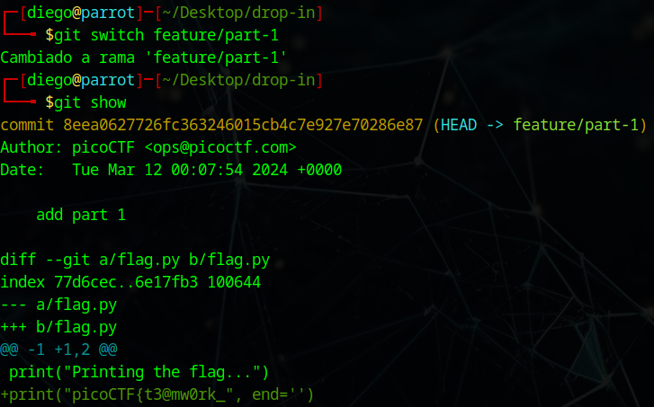
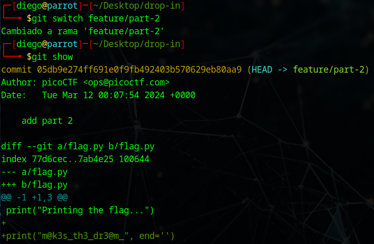
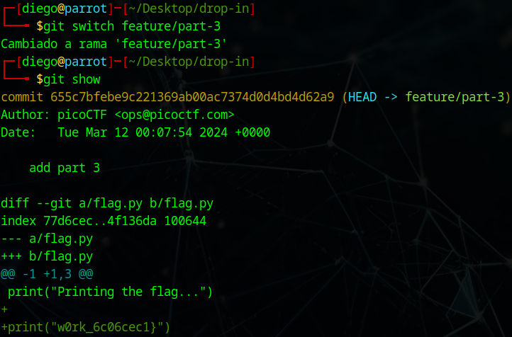

# Collaborative Development


## Descripción
My team has been working very hard on new features for our flag printing program! I wonder how they'll work together? You can download the challenge files here:  
- [challenge.zip](https://artifacts.picoctf.net/c_titan/178/challenge.zip)

## Resolución
Descargamos el archivo y lo descomprimimos:

```bash
unzip challenge.zip
```

Entramos en la carpeta creada y vemos su contenido:

```bash
cd drop-in
```

```bash
ls -la
```



El archivo 'flag.py' sólo tiene una línea:

```python
print("Printing the flag...")
```

Con 'git show' vemos que no tiene más commits realizados, por lo que investigamos las ramas:

```bash
git branch -a
```



Vemos que tiene otras tres ramas disponibles:
- feature/part-1
- feature/part-2
- feature/part-3

Para cambiar de rama usaremos el comando:

```bash
git switch feature/part-X
```

Al ver el historial de cambios, se mostrará una parte de la flag. La flag está fragmentada en las tres ramas:
- feature/part-1



- feature/part-2



- feature/part-3



Obteniendo así la flag: 'picoCTF{t3@mw0rk_m@k3s_th3_dr3@m_w0rk_6c06cec1}'.