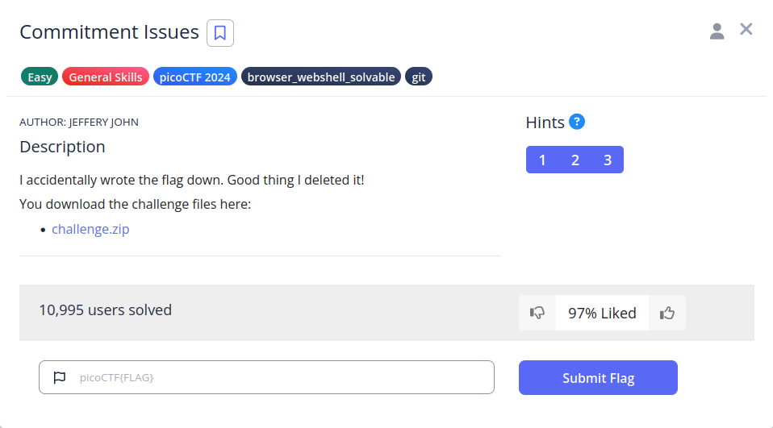

# Commitment Issues


## Descripción
I accidentally wrote the flag down.  
Good thing I deleted it! You download the challenge files here:  
- [challenge.zip](https://artifacts.picoctf.net/c_titan/76/challenge.zip)

## Resolución
Descargamos el archivo y lo extraemos:

```bash
unzip challenge.zip 
```

Dentro de él podemos ver una carpeta .git oculta:


Viendo el historial de cambios, observamos que se creó la flag y posteriormente se eliminó:

```bash
git log
```


Así que vemos la diferencia entre los dos commits con:

```bash
git diff
```


Obteniendo así la flag: 'picoCTF{s@n1t1z3_7246792d}'.