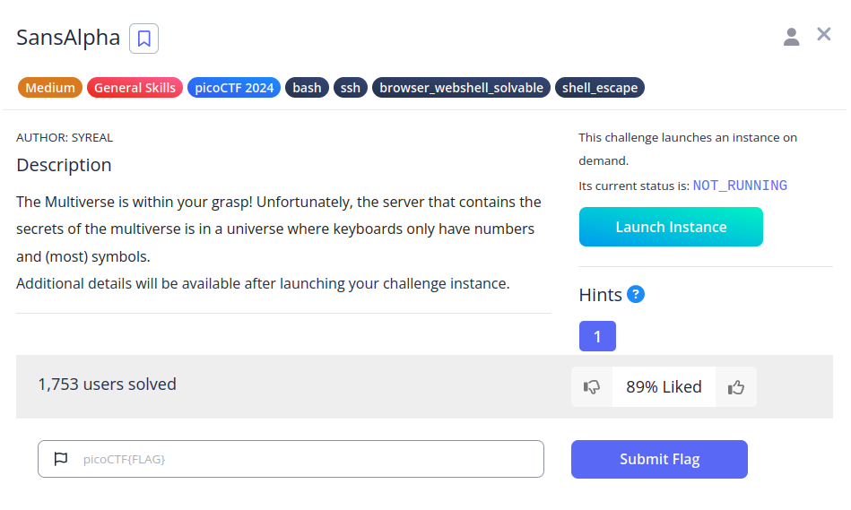
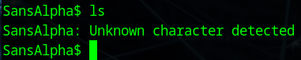
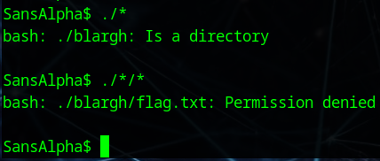
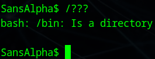
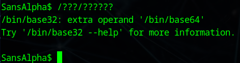
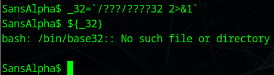
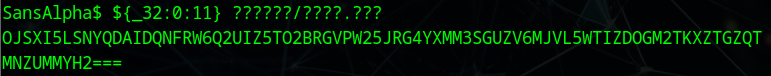
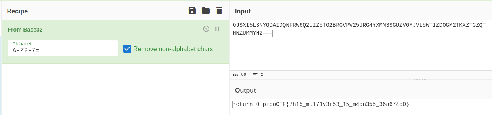

# SansAlpha


## Descripción
The Multiverse is within your grasp! Unfortunately, the server that contains the secrets of the multiverse is in a universe where keyboards only have numbers and (most) symbols.  
Additional details will be available after launching your challenge instance.

## Resolución
Nos conectamos al servidor después de lanzar la instancia:

```bash
ssh -p 54546 ctf-player@mimas.picoctf.net
```

Indicamos que queremos realizar la conexión con 'yes' e introducimos la contraseña. Una vez dentro deberemos movernos por la consola sin utilizar las letras, puesto que lanzará un error:



En primer lugar, usaremos las 'wildcards', que son símbolos que se corresponden con cualquier letra:
- ?: Se corresponde con una letra.
- *: Se corresponde con una o varias letras.

Así podremos ver el contenido de la carpeta en la que estamos, llegando a la siguiente estructura:



Ahora, tendremos que usar un comando para poder ver el contenido del archivo, para ello exploraremos el directorio raíz:



Viendo que la primera opción usando '/???' es bin, entraremos y consultaremos los comandos disponibles.



Explorando, encontramos los comandos base32 y base64. Podemos pasar como parámetro el archivo de la flag y luego descodificarlo, para ello primero tenemos que construir el comando, puesto que lo que se nos muestra por pantalla es un error, no la ejecución del comando en si.

Almacenamos el error en la variable '_32':

```bash
_32=`/???/????32 2>&1`
```

Comprobamos que el texto se ha guardado correctamente:

```bash
${_32}
```



Ahora, del error, tomamos de la posición 0 a la 11 para elaborar el comando. Además le añadimos la ruta de la flag con la wildcad '?':

```bash
${_32:0:11} ??????/????.???
```



OJSXI5LSNYQDAIDQNFRW6Q2UIZ5TO2BRGVPW25JRG4YXMM3SGUZV6MJVL5WTIZDOGM2TKXZTGZQT
MNZUMMYH2===

Aplicamos en [Cybercheff](https://cyberchef.org/) la receta 'From Base32':



Y obtenemos así la flag: 'picoCTF{7h15_mu171v3r53_15_m4dn355_36a674c0}'.