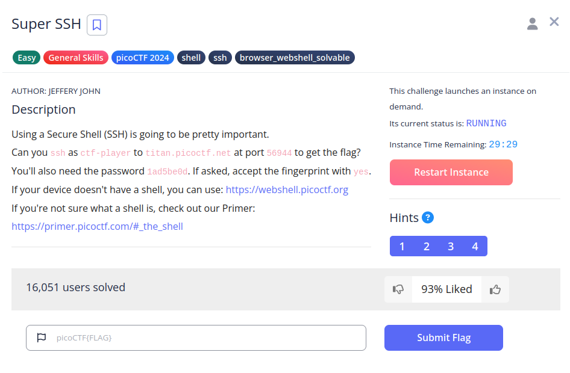
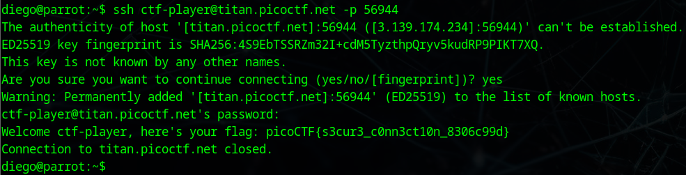

# Super SSH


## Descripción
Using a Secure Shell (SSH) is going to be pretty important.
Can you ssh as ctf-player to titan.picoctf.net at port 56944 to get the flag? You'll also need the password 1ad5be0d. If asked, accept the fingerprint with yes.
If your device doesn't have a shell, you can use: [https://webshell.picoctf.org](https://webshell.picoctf.org/) If you're not sure what a shell is, check out our Primer: [https://primer.picoctf.com/#_the_shell](https://primer.picoctf.com/#_the_shell)

## Resolución
Nos tenmdremos que conectar al servidor por SSH con los datos que nos han proporcionado, para ello montaremos el siguiente comando:

```bash
ssh ctf-player@titan.picoctf.net -p 56944
```

Al establecer la conexión nos pedirá la contraseña:



Y obtendremos la flag: 'picoCTF{s3cur3_c0nn3ct10n_8306c99d}'.