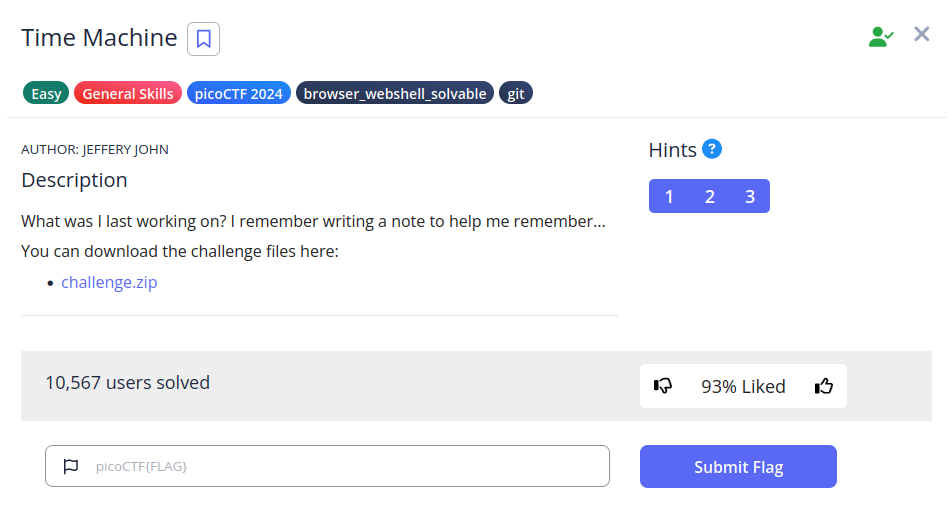
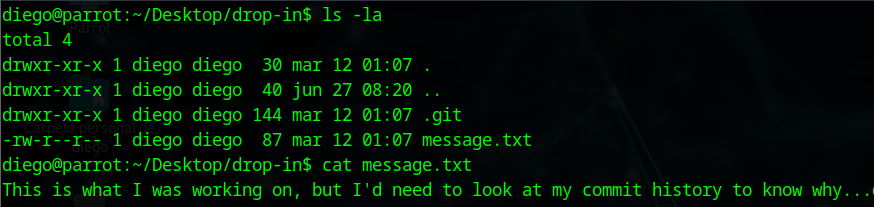
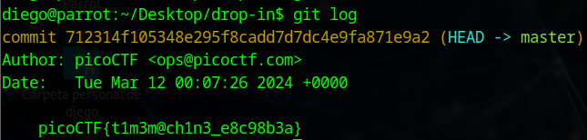

# Super SSH


## Descripción
What was I last working on? I remember writing a note to help me remember... You can download the challenge files here:

- [challenge.zip](https://artifacts.picoctf.net/c_titan/162/challenge.zip)

## Resolución
Extraemos el contenido del archivo comprimido:

´´´bash
unzip challenge.zip
´´´

Se nos creará la carpeta 'drop-in' con el siguiente contenido:



Encontramos una carpeta oculta .git y un mensaje que nos dice que miremos el historial de cambios.
Para ello tendremos que mirar con git los commits realizados:

```bash
git log
```



Obteniendo así la flag 'picoCTF{t1m3m@ch1n3_e8c98b3a}'.