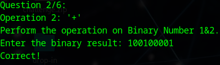

# binhexa


## Descripción
How well can you perfom basic binary operations?  
Additional details will be available after launching your challenge instance.

## Resolución
Una vez que nos conectemos, se nos proporcionarán dos números en binario y deberemos hacer una serie de operaciones con ellos:


Muchas de estas operaciones podremos hacerlas manualmente, sin embargo para otras necesitaremos una consola con python abierta:

```bash
python3
```

1. Para la primera operación se nos pide realizar un &, esto es un 'and' entre los dos números. Lo realizaremos en python de la siguiente forma:

```python
a = int("11000101", 2)
b = int("01011100", 2)
print(bin(a&b))
```
Obteniendo como resultado: '0b1000100', quitando el '0b' tendremos el número a introducir:


2. Ahora nos pide una suma:

```python
print(bin(a+b))
```


Obteniendo como resultado '100100001'.



3. En tercer lugar nos pide un desplazamiento de un bit a la izquierda en el primer binario. Esto se hace moviendo todos los números un lugar a la izquierda:


4. Ahora nos pide un desplazamiento a la derecha en el segundo binario:


5. En penúltimo lugar nos pide una multiplicación, para ello recurriremos a python:

```python
print(bin(a*b))
```


Obteniendo como resultado '100011011001100'.


6. Para finalizar, nos pide que realicemos un 'or':

```python
print(bin(a|b))
```


Obteniendo como resultado: '11011101'.


Y que introduzcamos ese número en hexadecimal:

```python
print(hex(a|b))
```


Obteniendo '0xdd'.


Y devolviendo la flag: 'picoCTF{b1tw^3se_0p3eR@tI0n_su33essFuL_aeaf4b09}'.