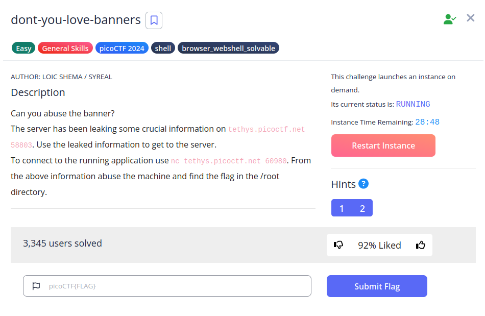
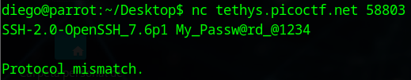
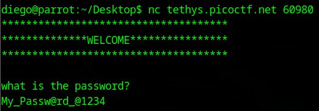
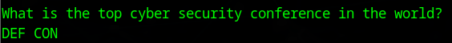
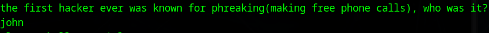
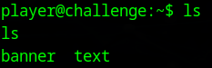
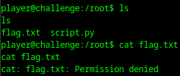
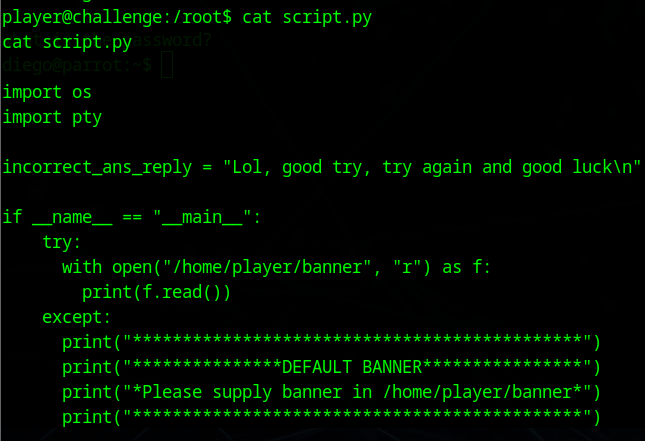
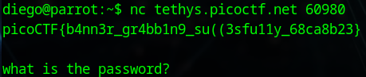

# Binary Searh


## Descripción
Can you abuse the banner? The server has been leaking some crucial information on tethys.picoctf.net 58803. Use the leaked information to get to the server. To connect to the running application use nc tethys.picoctf.net 60980. From the above information abuse the machine and find the flag in the /root directory.

## Resolución
Nos conectamos al primer servidor y obtenemos el siguiente resultado:

```bash
nc tethys.picoctf.net 58803
```



Con esto tenemos la contraseña 'My_Passw@rd_@1234'.

Ahora miramos el siguiente servidor:

```bash
nc tethys.picoctf.net 60980
```

Al entrar nos pedirá la contraseña:



Tras esto, nos realizará una serie de preguntas que se pueden resolver buscando en internet:





Al acabar, nos dará acceso a la consola con el usuario 'player'.



Si nos movemos a la carpeta /root, encontraremos el archivo de la flag, que no podremos abrir:



El otro archivo disponible contiene el código de python que nos realiza las preguntas al conectarnos al servidor:



Como se puede ver, requiere que le proporcionemos un banner desde una carpeta a la que sí tenemos permisos para modificar, por lo que borraremos el banner y crearemos uno nuevo que muestre el archivo flag.txt. Para ello crearemos un link simbólico:

```bash
ln -s /root/flag.txt banner
```

Ahora, el código de python cuando abra '/home/player/banner' se encontrará con un enlace a '/root/flag.txt' y, como lo está ejecutando con permisos de root, lo mostrará por pantalla:



Obteniendo así la flag 'picoCTF{b4nn3r_gr4bb1n9_su((3sfu11y_68ca8b23}'.