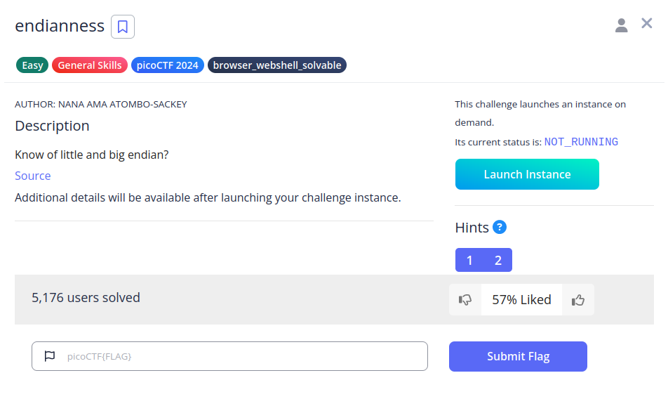

# endianness


## Descripción
Know of little and big endian?  
[Source](https://artifacts.picoctf.net/c_titan/118/flag.c)  
Additional details will be available after launching your challenge instance.

## Resolución
Las instrucciones se encuentran dentro del archivo:

```c
printf("Welcome to the Endian CTF!\n");
printf("You need to find both the little endian and big endian representations of a word.\n");
printf("If you get both correct, you will receive the flag.\n");
```

Nos piden devolver una palabra generada automáticamente en orden de bytes pequeños y grandes. Nos conectamos para obtener la palabra:


En este caso ha sido 'ujygd', por lo que pasamos a convertirla en [hexadecimal](https://www.rapidtables.com/convert/number/ascii-to-hex.html):
- 'u' = 0x75
- 'j' = 0x6A
- 'y' = 0x79
- 'g' = 0x67
- 'd' = 0x64

Ahora tenemos los valores, por lo que procedemos a ordenarlos:
- Big Endian: 0x756A796764
- Little Endian: 0x6467796A75


Introduciendo los valores eliminando '0x' obtendremos la flag: 'picoCTF{3ndi4n_sw4p_su33ess_817b7cfe}'.