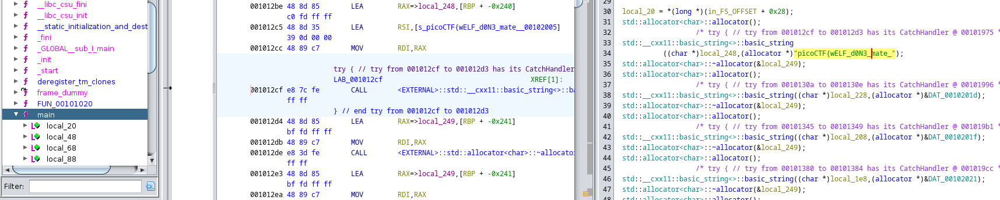
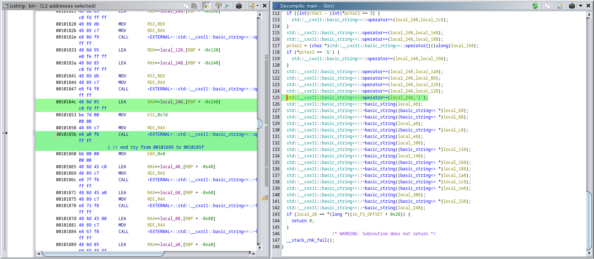
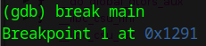
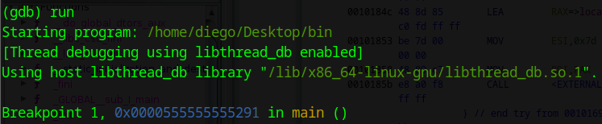
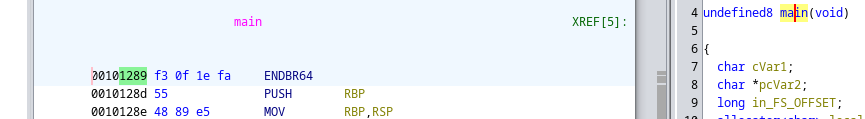
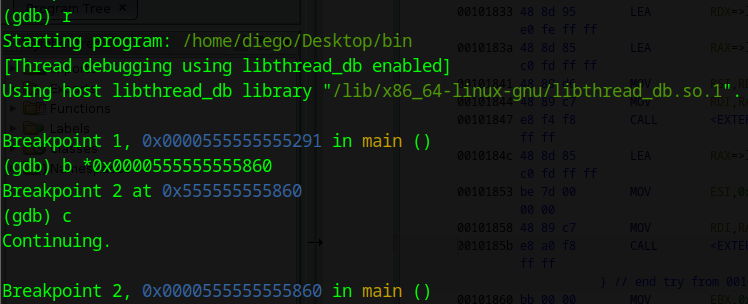
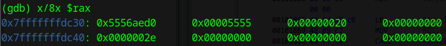
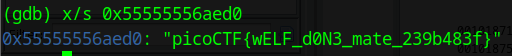

# FactCheck


## Descripción
This binary is putting together some important piece of information...  
Can you uncover that information?  
Examine this [file](https://artifacts.picoctf.net/c_titan/186/bin). Do you understand its inner workings?

## Resolución
Nos descargamos el archivo y lo abrimos con ghidra.

```bash
ghidra bin
```

Al encontrar la función main veremos la primera mitad de la flag:



Teniendo 'picoCTF{wELF_d0N3_mate_', continuamos analizando el código.

Avanzando en el código, vemos la última concatenación de la flag '}'.



Usaremos un debugger para deterner la ejecución del programa en el momento que se complete la flag y, posteriormente, explorar sus direcciones de memoria.

Anotamos la dirección de memoria de la flag construida, en este caso '00101865' y lanzamos gdb:

```bash
gdb bin
```

Iniciamos poniendo un breakpoint en main, para así tener una referencia del desplazamiento de memoria usado:



Ahora ejecutamos el programa con el comando run, y vemos la dirección de memoria para analizar el desplazamiento:



Esta dirección es muy diferente a la encontrada en ghidra:




La dirección ha pasado de ser '00101289' en ghidra a ser '0x1291' antes de la ejecución y '0x0000555555555291' al ejecutar. Esto nos da un desplazamiento de '0x0000555555555XXX', por lo que sustituimos estos tres últimos múmeros por los tres últimos números de donde queremos poner el breakpoint, siendo en este caso 860, que se corresponde con la primera línea después de haber construido la flag:



Ahora hay que analizar las direcciones de memoria:



La más prometedora es la primera, por lo que la mostramos como string, no sin antes modificarla para que tenga el tamaño de las direcciones de memoria del programa. Como todas las direcciones tienen 12 números (0x555555555860), tendremos que rellenar el restante con 5, que es el número que se ha omitido para mostrar mejor la dirección:



Oteniendo así la flag: 'picoCTF{wELF_d0N3_mate_239b483f}'.