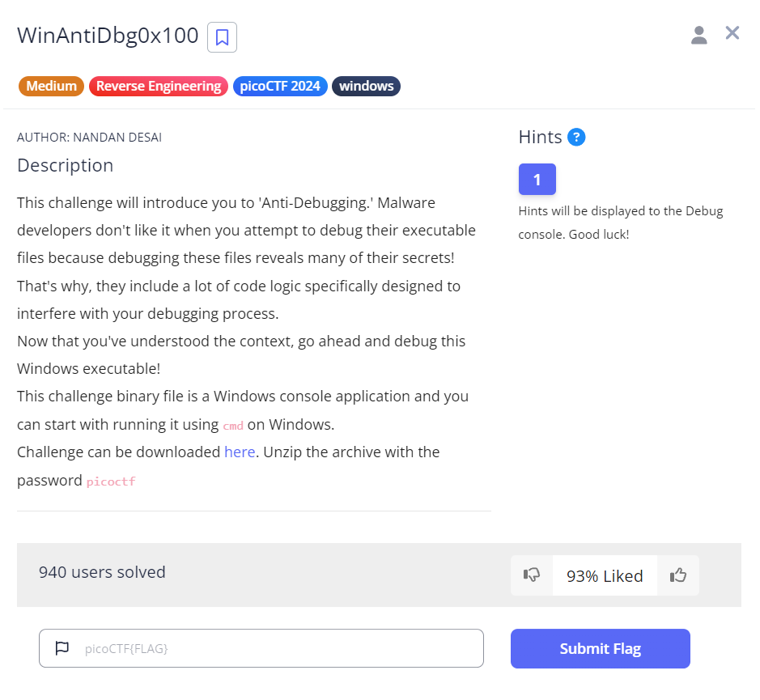
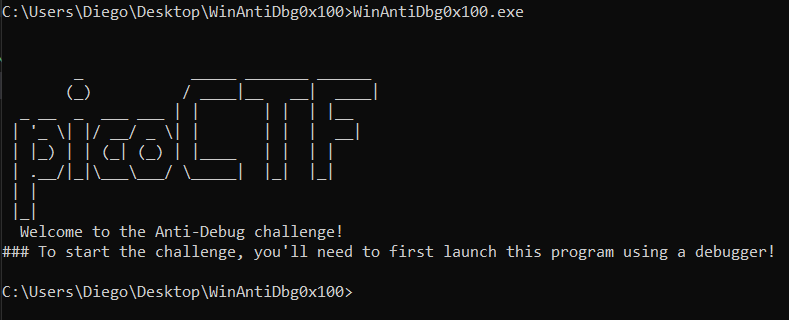
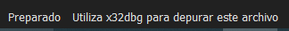
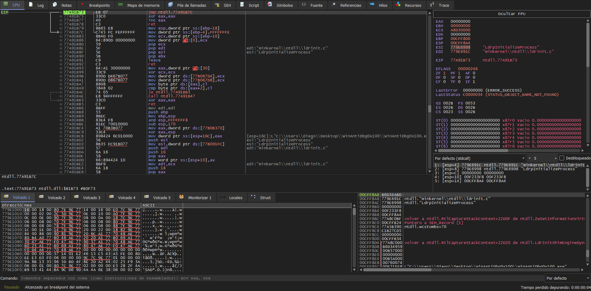
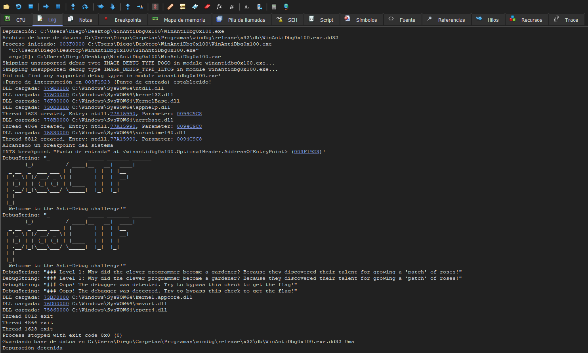
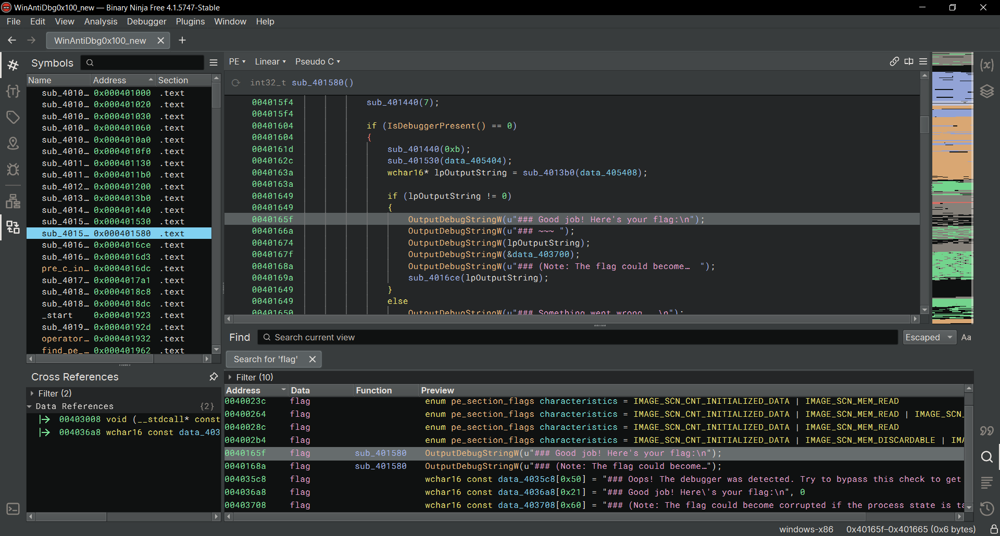
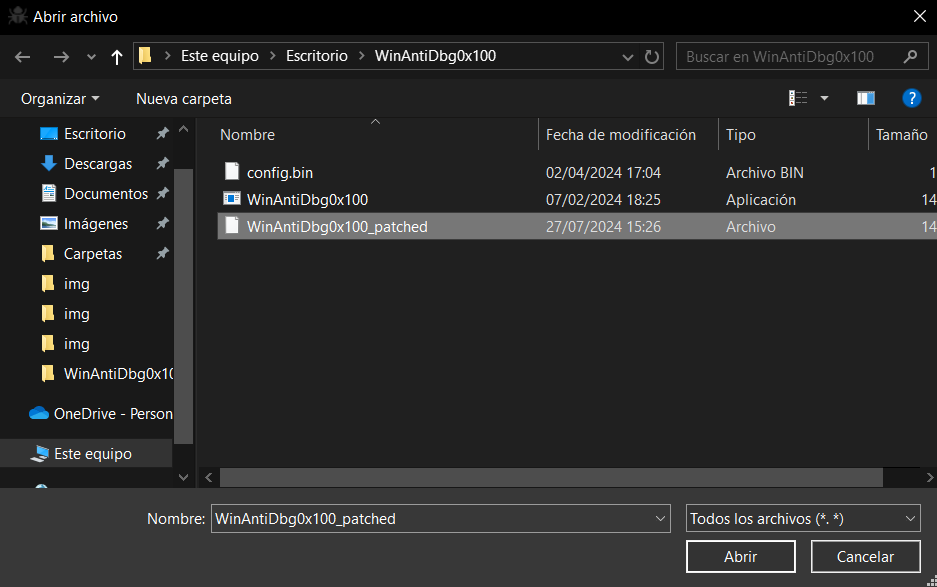
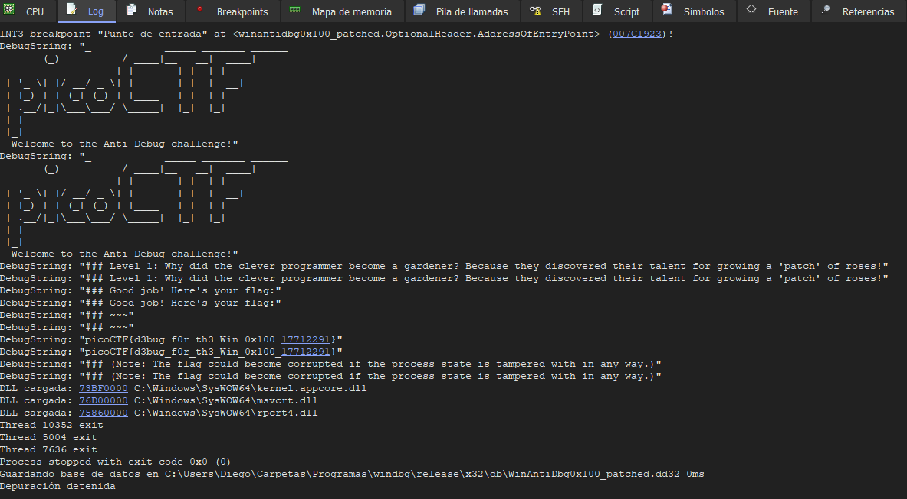

# WinAntiDbg0x100


## Descripción
This challenge will introduce you to 'Anti-Debugging.' Malware developers don't like it when you attempt to debug their executable files because debugging these files reveals many of their secrets! That's why, they include a lot of code logic specifically designed to interfere with your debugging process.  
Now that you've understood the context, go ahead and debug this Windows executable! 
This challenge binary file is a Windows console application and you can start with running it using cmd on Windows.
Challenge can be downloaded [here](https://artifacts.picoctf.net/c_titan/54/WinAntiDbg0x100.zip). Unzip the archive with the password picoctf

## Resolución
Descargamos el archivo y lo extraemos en una carpeta con su mismo nombre. En este CTF usaremos Windows 10. Para ejecutar el programa usaremos el cmd:

```
WinAntiDbg0x100.exe
```



Nos pide un debugger, por lo que usaremos [x64dbg](https://x64dbg.com/). Aunque si lo intentamos abrir con su versión de 64 bits nos dará un error en la parte inferior izquierda de la pantalla:



Con la versión de 32 bits podremos ver el código ensamblador del programa:



Después de darle a 'ejecutar' varias veces se nos mostrará en el log información:



'### Oops! The debugger was detected. Try to bypass this check to get the flag!'

Para encontrar qué lanza el mensaje usaremos [Binary Ninja](https://binary.ninja/free/). Al realizar una búsqueda de 'flag' encontraremos la función:



Vemos que la condición que impide imprimir la flag es 'if (IsDebuggerPresent() == 0)', por lo que podemos símplemente invertirla con Click derecho -> Patch -> Invert Branch. Ahora cuando lo usemos con el debugger nos imprimirá la flag.
Vamos a File -> Save as -> Save file contents only y lo guardamos con un nuevo nombre.
Volvemos a x64dbg y abrimos el programa. Para ello tenemos que indicarle que busque archivos con todas las extensiones:



Vamos a la pestaña log, a limpiamos con Ctrl + L y ejecutamos el programa con la primera flecha horizontal del menú superior. Al darle dos veces aparecerá lo siguiente:



Obteniendo así la flag: 'picoCTF{d3bug_f0r_th3_Win_0x100_17712291}'.