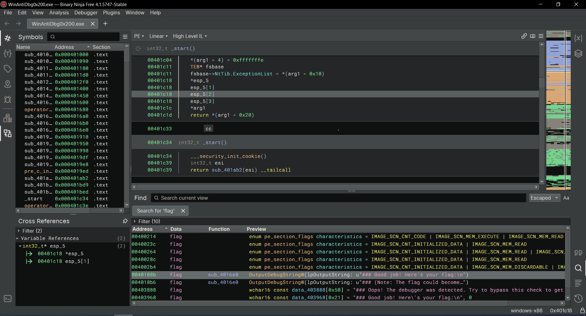

# WinAntiDbg0x200


## Descripción
If you have solved WinAntiDbg0x100, you'll discover something new in this one. Debug the executable and find the flag!  
This challenge executable is a Windows console application, and you can start by running it using Command Prompt on Windows.
This executable requires admin privileges. You might want to start Command Prompt or your debugger using the 'Run as administrator' option.  
Challenge can be downloaded [here](https://artifacts.picoctf.net/c_titan/57/WinAntiDbg0x200.zip). Unzip the archive with the password picoctf

## Resolución
Descargamos el archivo y lo extraemos en una carpeta con su mismo nombre. En este CTF usaremos Windows 10. Para ejecutar el programa usaremos el cmd (esta vez en modo administrador):

```
WinAntiDbg0x100.exe
```


Debido a que este programa carga archivos .dll del kernel, es necesario ejecutar [x64dbg](https://x64dbg.com/) en su versión de 32 bits en modo administrador para poder ver el log:


De nuevo, abrimos [Binary Ninja](https://binary.ninja/free/), importamos el archivo .exe y buscamos con Ctrl + f la palabra 'flag':



Damos doble click a la dirección de memoria y vemos las condiciones:


Esta vez tendremos que realizarlo en dos pasos:

1. Para la condición 'if (edx_2 == 0 && eax_8 == 0)' le damos Click derecho -> Patch -> Always branch.
Ahora se nos modificará el código:


2. Para la condición if (zx.d(sub_4011d0()) != 0) le damos Click derecho -> Patch -> Never branch.

Vamos a File -> Save as -> Save file contents only y lo guardamos con un nuevo nombre.
Volvemos a x64dbg y abrimos el programa. Para ello tenemos que indicarle que busque archivos con todas las extensiones. Vamos a la pestaña log, a limpiamos con Ctrl + L y ejecutamos el programa con la primera flecha horizontal del menú superior. Al darle dos veces aparecerá lo siguiente:


Obteniendo así la flag: 'picoCTF{0x200_debug_f0r_Win_ce2f78e8}'.