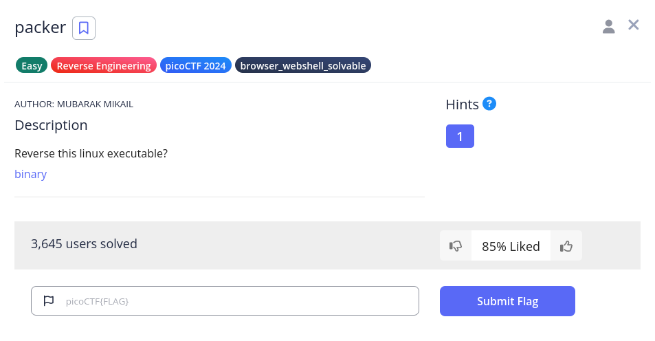
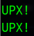
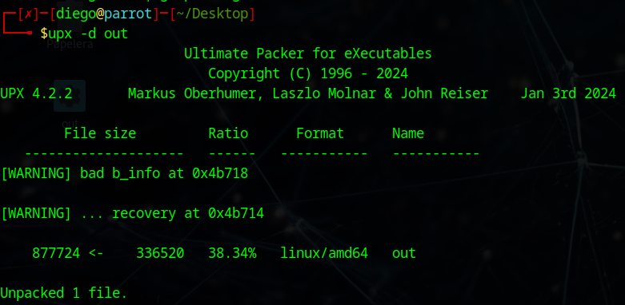
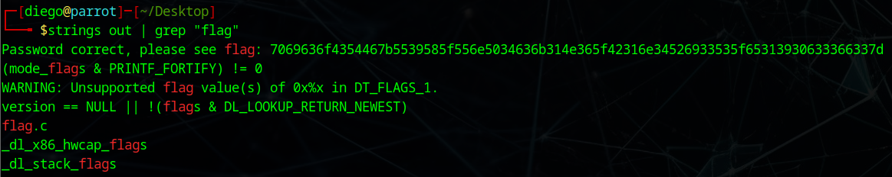
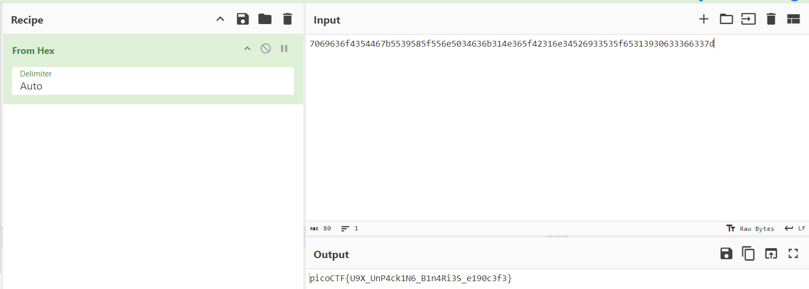

# packer


## Descripción
Reverse this linux executable?  
[binary](https://artifacts.picoctf.net/c_titan/101/out) 

## Resolución
Al descargar el archivo y analizarlo con strings encontramos lo siguiente

```bash
strings out
```



Esto indica que el ejecutable ha sido comprimido con UPX, por lo que procedemos a descomprimirlo:

```bash
upx -d out
```



Ahora, podemos buscar la flag en el:

```bash
strings out | grep "flag"
```



Obtenemos '7069636f4354467b5539585f556e5034636b314e365f42316e34526933535f65313930633366337d', por lo que vamos a [Cybercheff](https://gchq.github.io/CyberChef/) a descifrarlo:



Usando la opción 'magic' o 'From Hex' se nos mostrará la flag: 'picoCTF{U9X_UnP4ck1N6_B1n4Ri3S_e190c3f3}'.
