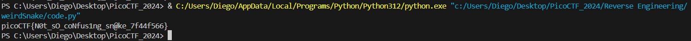

# weirdSnake


## Descripción
I have a friend that enjoys coding and he hasn't stopped talking about a snake recently  
He left this [file](https://artifacts.picoctf.net/c_titan/126/snake) on my computer and dares me to uncover a secret phrase from it. Can you assist? 

## Resolución
Para la realización de este CTF se ha usado el vídeo de [Lavafroth](https://www.youtube.com/@lavafroth) [Taming a Weird Snake - PicoCTF Walkthrough](https://www.youtube.com/watch?v=DvtUAX5OZ18).

Al descargar el archivo y analizarlo con file nos encontraremos que son cadenas de caracteres ASCII:

```bash
file snake
```
Su contenido es el siguiente:

```bash
cat snake
```


Este código es python compilado y, si bien existen herramientas para deshacer la compilación, no nos dan en este CTF la información suficiente para realizarlo automáticamente, por lo que hay que ir instrucción por instrucción de forma manual.

- LOAD_CONST 0 (4): Carga en el hueco del stack 0 el carácter 4.
- BUILD_LIST 40: Le dice al stack que cree una lista con los últimos 40 elementos.
- STORE_NAME 0 (input_list): Guarda la lista creada con el nombre 'input:list'

Analizaremos el código:

```
84 LOAD_CONST                  31 ('J')
86 STORE_NAME               1 (key_str)

88 LOAD_CONST               32 ('_')
90 LOAD_NAME                1 (key_str)

92 BINARY_ADD
94 STORE_NAME               1 (key_str)
```

1. Guarda en el stack 'J'
2. Guarda 'J' como 'key_str'
3. Guarda en el stack '_'
4. Carga 'key_str' ('J')
5. Realiza una suma (concatenacion) creando '_J'
6. Lo guarda en key_str

```
96 LOAD_NAME                1 (key_str)
98 LOAD_CONST              33 ('o')
100 BINARY_ADD
102 STORE_NAME               1 (key_str)

104 LOAD_NAME                1 (key_str)
106 LOAD_CONST              34 ('3')
108 BINARY_ADD
110 STORE_NAME               1 (key_str)

112 LOAD_CONST              35 ('t')
114 LOAD_NAME                1 (key_str)
116 BINARY_ADD
118 STORE_NAME               1 (key_str)
```
7. Carga 'key_str' ('_J')
8. Carga 'o'
9. Lo concatena creando ('_Jo')
10. Lo guarda en key_str
11. Carga 'key_str' ('_Jo')
12. Carga '3'
13. Lo concatena creando ('_Jo3')
14. Lo guarda en key_str
15. Carga 't'
16. Carga 'key_str' ('_Jo3')
17. Lo concatena creando ('t_Jo3')
18. Lo guarda en key_str

```
120 LOAD_CONST              36 (<code object <listcomp> at 0x7ff3b9776d40, file "snake.py", line 9>)
122 LOAD_CONST              37 ('<listcomp>')
124 MAKE_FUNCTION            0
126 LOAD_NAME                1 (key_str)
128 GET_ITER
130 CALL_FUNCTION            1
132 STORE_NAME               2 (key_list)
```

En esta sección se construye una lista y se itera a través de la cadena creada. El código de listcomp (9) es el siguiente:

```
9       0 BUILD_LIST               0
        2 LOAD_FAST                0 (.0)
        >>    4 FOR_ITER                12 (to 18)
              6 STORE_FAST               1 (char)
              8 LOAD_GLOBAL              0 (ord)
             10 LOAD_FAST                1 (char)
             12 CALL_FUNCTION            1
             14 LIST_APPEND              2
             16 JUMP_ABSOLUTE            4
        >>   18 RETURN_VALUE
```

Para cada elemento de la lista, se aplica la función ord().

```
134 LOAD_NAME                3 (len)
136 LOAD_NAME                2 (key_list)
138 CALL_FUNCTION            1
140 LOAD_NAME                3 (len)
142 LOAD_NAME                0 (input_list)
144 CALL_FUNCTION            1
146 COMPARE_OP               0 (<)
148 POP_JUMP_IF_FALSE      162
```

Aquí se crean dos variables:
- len(key_list)
- len(input_list)
Y se comparan tal que (len(key_list) < len(input_list)). Si esta comprobación es falsa el programa saltará a la línea 162.

```
150 LOAD_NAME                2 (key_list)
152 LOAD_METHOD              4 (extend)
154 LOAD_NAME                2 (key_list)
156 CALL_METHOD              1
158 POP_TOP
160 JUMP_ABSOLUTE          134
```

Este es el fragmento que se ejecuta si la comprobación es correcta, usando el método key_list.extend(key_list). 'POP_TOP' es necesario puesto que este método devuelve un none. Tras esto se vuelve a saltar a la línea 134.

```
162 LOAD_CONST              38 (<code object <listcomp> at 0x7ff3b9776df0, file "snake.py", line 15>)
164 LOAD_CONST              37 ('<listcomp>')
166 MAKE_FUNCTION            0
168 LOAD_NAME                5 (zip)
170 LOAD_NAME                0 (input_list)
172 LOAD_NAME                2 (key_list)
174 CALL_FUNCTION            2
176 GET_ITER
178 CALL_FUNCTION            1
180 STORE_NAME               6 (result)
```

Aquí, se crea una nueva lista (listcomp), que tendrá como contenido pares (zip) de los elementos de input_list y key_list. El código de listcomp (15) es el siguiente:

```
15      0 BUILD_LIST               0
        2 LOAD_FAST                0 (.0)
        >>    4 FOR_ITER                16 (to 22)
              6 UNPACK_SEQUENCE          2
              8 STORE_FAST               1 (a)
             10 STORE_FAST               2 (b)
             12 LOAD_FAST                1 (a)
             14 LOAD_FAST                2 (b)
             16 BINARY_XOR
             18 LIST_APPEND              2
             20 JUMP_ABSOLUTE            4
        >>   22 RETURN_VALUE
```

Se crea una lista y, con los dos elementos se realiza la operaicón XOR con los dos valores bit a bit.

```
182 LOAD_CONST              39 ('')
184 LOAD_METHOD              7 (join)
186 LOAD_NAME                8 (map)
188 LOAD_NAME                9 (chr)
190 LOAD_NAME                6 (result)
192 CALL_FUNCTION            2
194 CALL_METHOD              1
196 STORE_NAME              10 (result_text)
198 LOAD_CONST              40 (None)
200 RETURN_VALUE
```

Por último, se aplica a cada elemento de la lista la función chr() con map(), guardando el resultado en result_text. Como se aplica un join con '' antes, sólo se unen todos los caracteres. Por último, el programa finaliza.

Tras esto, se debe de deshacer el código en python:

```python
input_list = [4, 54, 41, 0, 112, 32, 25, 49, 33, 3, 0, 0, 57, 32, 108, 23, 48, 4, 9, 70, 7, 110, 36, 8, 108, 7, 49, 10, 4, 86, 43, 104, 44, 91, 7, 18, 106, 124, 89, 78]
key_str = 't_Jo3'
key_list = [ord(char) for char in key_str]

while len(key_list) < len(input_list): 
    key_list.extend(key_list)

result = [a ^ b for a, b in zip(input_list, key_list)]
print(''.join(map(chr, result)))
```

El resultado de ejecutar el código es:



Obteniendo así la flag: 'picoCTF{N0t_sO_coNfus1ng_sn@ke_7f44f566}'.