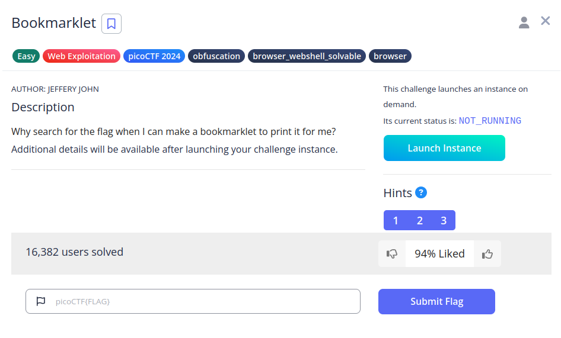
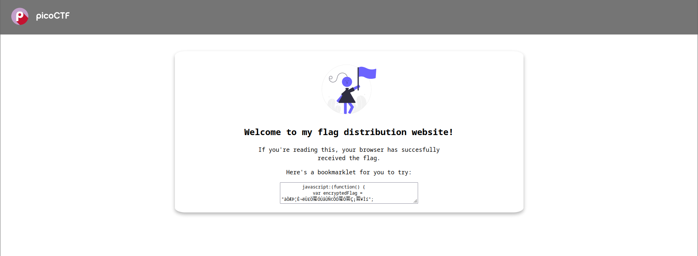
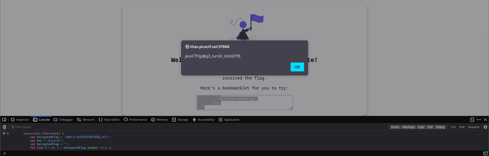

# Bookmarklet

## Descripción
Why search for the flag when I can make a bookmarklet to print it for me?

Additional details will be available after launching your challenge instance.

## Resolución
Lanzamos la instancia y entramos en la página web:

Nos proporciona un código javascript, por lo que procedemos a ejecutarlo en la consola del navegador.
Damos click derecho y seleccionamos inspeccionar, después vamos a consola y pegamos el código proporcionado:

Obteniendo así la flag: 'picoCTF{p@g3_turn3r_0c0d211f}'.