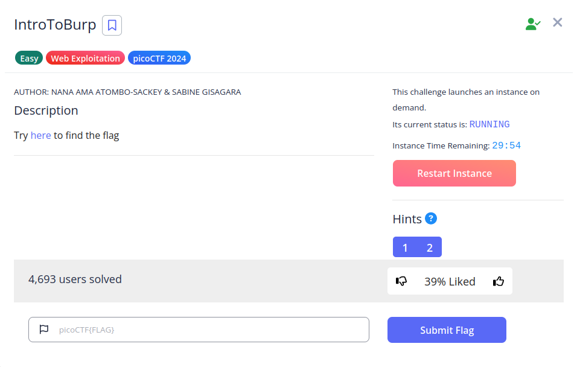
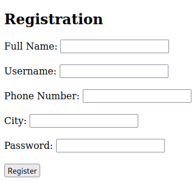
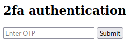
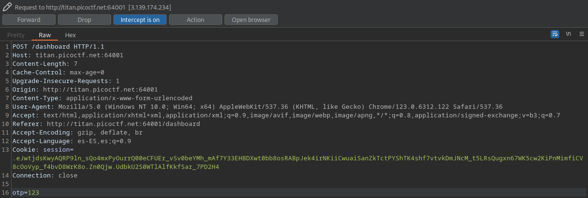
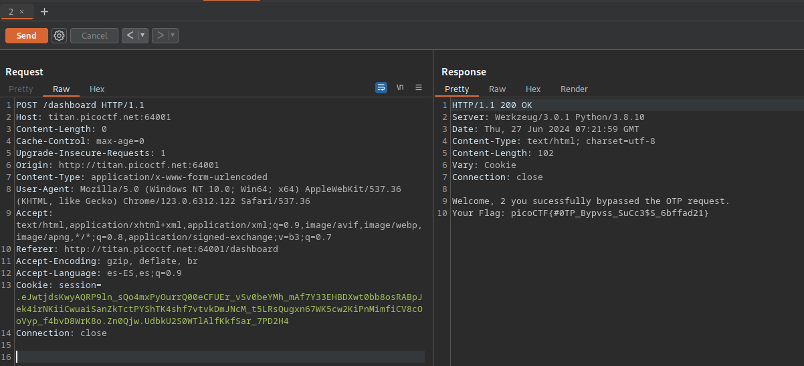

# IntroToBurp

## Descripción
Try [here](http://titan.picoctf.net:64001/) to find the flag

## Resolución
Entraremos en la página y encontraremos el siguiente formulario:

Al registrarmos nos pide un 2fa:

Al enviar cualquier dato nos dará el mensaje 'Invalid OTP'. Para solucionar esto el título del CTF nos da una pista, por lo que ejecutamos burpsuite e interceptamos la petición del 2fa:

Ahora, la enviamos al repetidor con Ctrl + R y probamos a borrar la línea:

Es importante borrar sólo 'opt=123', no toda la línea.

Con esto obtenemos la flag: 'picoCTF{#0TP_Bypvss_SuCc3$S_6bffad21}'.