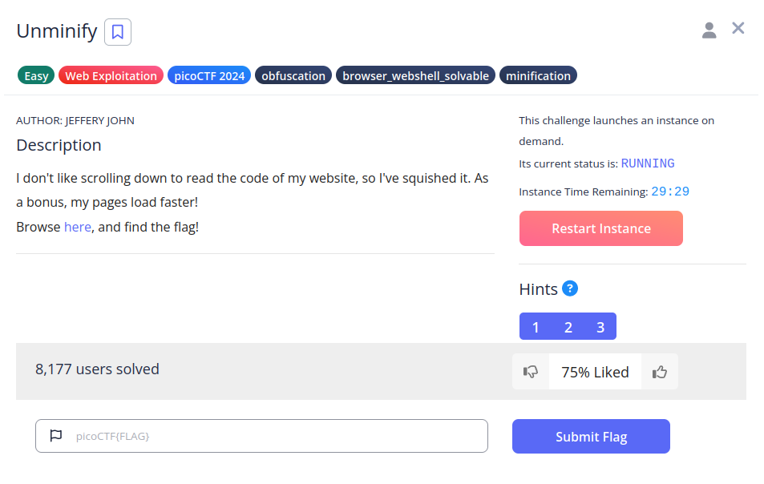
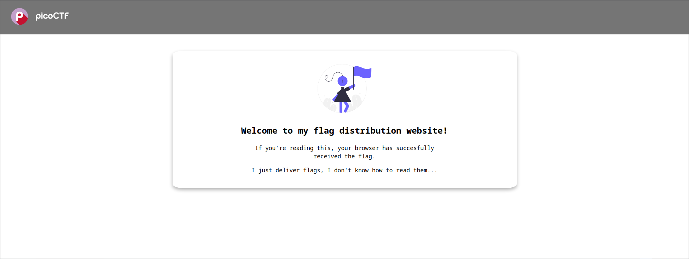
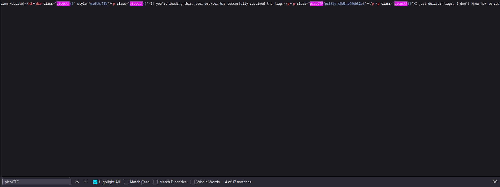

# Unminify

## Descripción
I don't like scrolling down to read the code of my website, so I've squished it. As a bonus, my pages load faster!  
Browse [here](http://titan.picoctf.net:60813/), and find the flag!

## Resolución
Entraremos en una página que nos avisará que ya hemos recibido la flag en el navegador:

Al buscar en el código fuente 'picoCTF' con Ctrl + F la encontraremos:

Obteniendo así la flag: 'picoCTF{pr3tty_c0d3_b99eb82e}'.