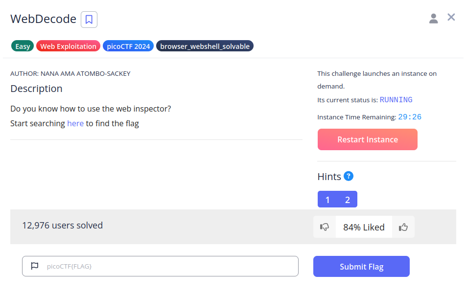
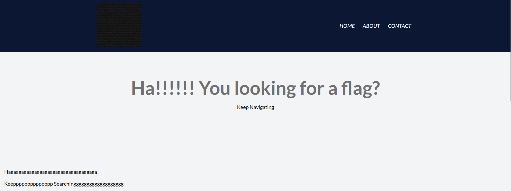
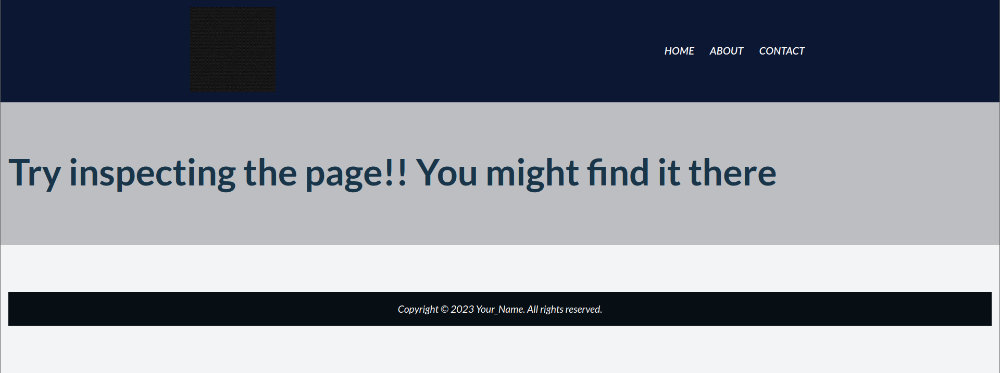
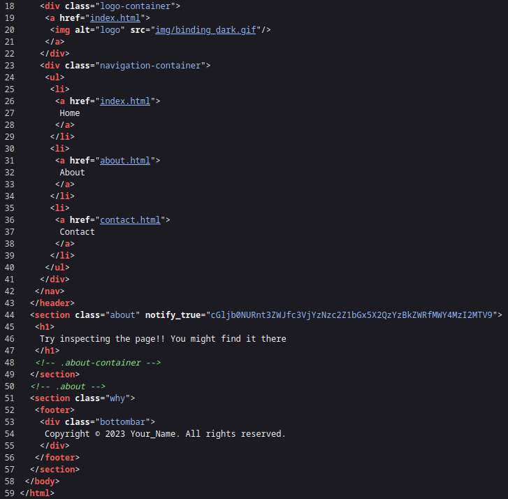
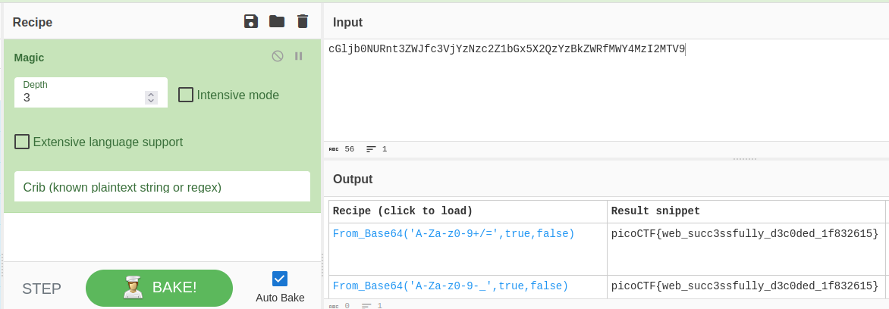

# WebDecode

## Descripción
Do you know how to use the web inspector?

Start searching [here](http://titan.picoctf.net:49621/) to find the flag

## Resolución
Entramos en la página web y veremos lo siguiente:

Seguimos buscando y entraremos en el apartado de "sobre nosotros":

Donde nos dicen que inspeccionemos la página:

En el section, vemos un atributo llamado 'notify_true', que parece que su contenido está codificado. Al acudir a [CyberCheff](https://cyberchef.org/) encontraremos la flag:

Obteniendo así la flag 'picoCTF{web_succ3ssfully_d3c0ded_1f832615}'.